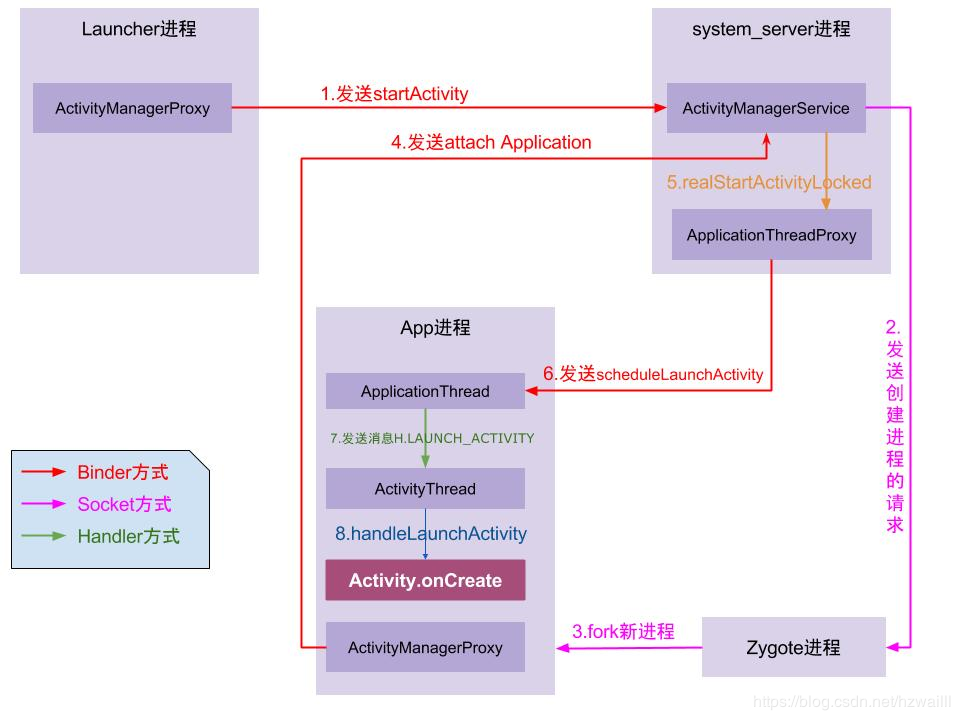

# ActivityThread
ActivityThread是包含main()方法的类；        
ActivityThread即Android的主线程，也就是UI线程，ActivityThread的main方法是一个APP的真正入口，MainLooper在它的main方法中被创建；
- 初始化的时候创建ApplicationThread，它是ActivityThread的私有内部类，实现了IBinder接口，用于ActivityThread和AMS的所在进程间通信；
  所以是一开始就在AMS中注册自己。
- 然后是先创建Application，再创建Activity；        
  如下：       
  