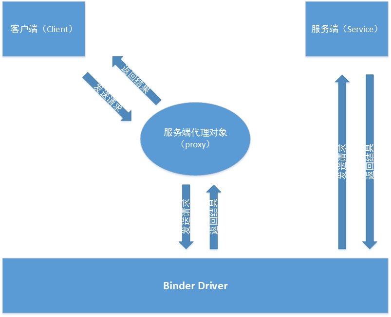
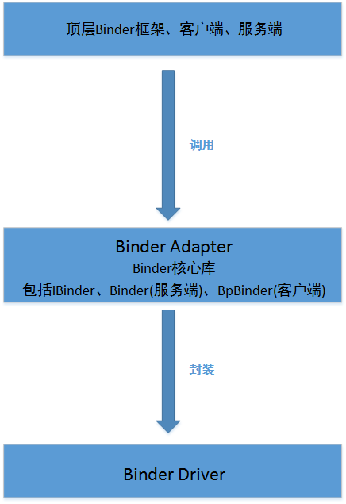

`目录：`
  - [Binder机制
](#9d5d929018a4b711acb3e33faaad2e14)
    - [Binder机制概述
](#abc4dc70acf9ba77309ae7e236d0c6e6)
    - [Binder机制的工作流程
](#d597aeebdc5b6df55ff9f741f8a88c02)
    - [Binder机制的组成
](#912e995525be84df26e3597b33e4dc99)
    - [Binder驱动的实现简介
](#a046425cfb2f9b9f9db714d14f16f6df)
    - [Binder驱动程序中的数据结构
](#0140b2971aad06a3f2d1ba4339b38717)
    - [Binder的详细实现
](#64c21f27e1c7ccec240d6b978213a5b3)
    - [Binder封装库
](#cac1c220a9b299b28642ee560e6e93df)

---
## Binder机制

### Binder机制概述

在Android开发中，很多时候我们需要用到进程间通信，所谓进程间通信，实现进程间通信的机制有很多种，
比如说socket、pipe等，Android中进程间通信的方式主要有三种：

1.标准Linux Kernel IPC 接口；

2.标准D-BUS接口；

3.Binder接口。

其中，Binder机制是使用最且最被认可的，因为Binder机制有以下优点：

1.相对于其它IPC机制，Binder机制更加简洁和快速；

2.消耗的内存相对更少；

3.传统的IPC机制可能会增加进程的开销，以及出现进程过载和安全漏洞，Binder机制则有效避免和解决了这些问题。

Binder机制是Android系统的核心机制，几乎贯穿于整个Android系统，Android系统基本上可以看作是一个基于binder通信机制的C/S架构，
Binder就像网络，把Android系统的各个部分连接到了一起。利用Binder机制，可以实现以下功能：

1.用驱动程序来推进进程间通信；

2.通过共享内存来提高性能；

3.为进程请求分配每个进程的线程池；

4.针对系统中的对象引入了引用计数和跨进程的对象引用映射；

5.进程间同步调用

### Binder机制的工作流程

1.客户端获取服务端的代理对象（proxy）。我们需要明确的是客户端进程并不能直接操作服务端中的方法，如果要操作服务端中的方法，
那么有一个可行的解决方法就是在客户端建立一个服务端进程的代理对象，这个代理对象具备和服务端进程一样的功能，
要访问服务端进程中的某个方法，只需要访问代理对象中对应的方法即可；

2.客户端通过调用代理对象向服务端发送请求。

3.代理对象将用户请求通过Binder驱动发送到服务器进程；

4.服务端进程处理客户端发过来的请求，处理完之后通过Binder驱动返回处理结果给客户端的服务端代理对象；

5.代理对象将请求结果进一步返回给客户端进程。

通过以上5个步骤，就完成了一次Binder通信。

### Binder机制的组成

Binder机制由三部分组成，即：

1.Client;

2.Server;

3.ServiceManager。

三部分组件之间的关系:

1.Client、Server、ServiceManager均在用户空间中实现，而Binder驱动程序则是在内核空间中实现的；

2.在Binder通信中，Server进程先注册一些Service到ServiceManager中，ServiceManager负责管理这些Service并向Client提供相关的接口；

3.Client进程要和某一个具体的Service通信，必须先从ServiceManager中获取该Service的相关信息，
Client根据得到的Service信息与Service所在的Server进程建立通信，之后Client就可以与Service进行交互了；

4.Binder驱动程序提供设备文件/dev/binder与用户空间进行交互，Client、Server和ServiceManager通过open和ioctl文件操作函数与Binder驱动程序进行通信；

5.Client、Server、ServiceManager三者之间的交互都是基于Binder通信的，所以通过任意两者这件的关系，都可以解释Binder的机制。

### Binder驱动的实现简介

1.Binder采用了AIDL来描述进程间的接口；

2.Binder是一个特殊的字符型设备，设备节点为dev/binder。

3.Binder驱动程序由以下两个文件实现：

①kernel/drivers/staging/binder.h

②kernel/drivers/staging/binder.c

4.在Binder驱动的实现过程中，以下函数起着关键作用：

①使用binder_ioctl()函数与用户空间交换数据；

②BINDER_WRITE_READ用来读写数据，数据包中的cmd域用于区分不同的请求；

③使用binder_thread_write()函数来发送请求或返回结果，在binder_thread_write()函数中，
通过调用binder_transaction()函数来转发请求并返回结果.当收到请求时，binder_transaction()函数会通过对象的handle找到对象所在的进程，
如果handle结果为空，则认为此对象是context_mgr，然后把请求发给context_mgr所在的进程，并将请求中所有的Binder对象放到RB树中，
最后把请求放到目标进程的队列中以等待目标进程的读取。；

④使用binder_thread_read()函数来读取结果；

⑤在函数binder_parse()中实现数据解析工作。

### Binder驱动程序中的数据结构

1.binder_work。binder_work表示在binder驱动中进程要处理的工作项。

2.binder_node。binder_node用于定义Binder实体对象。Android系统中每一个Service组件在Binder驱动程序中都对应一个Binder实体对象。
驱动中的Binder实体也叫做“节点”，你属于提供实体的进程；

3.binder_ref。binder_ref用于描述一个Binder引用对象。
Android系统中每一个Client组件在Binder驱动程序中都对应一个Binder引用对象；

4.binder_ref_death。binder_ref_death是一个通知结构体。只要某进程订阅了某binder引用对应实体的死亡通知，
那么binder驱动就会为该binder引用建立一个binder_ref_death通知结构体，将其保存在当前进程的对应binder引用结构体的death域中，
即Binder引用对象将死亡通知注册到Binder驱动程序中。这里涉及到Binder的死亡通知机制，
Binder的死亡通知机制具体指：如果Binder实体对象意外死亡，那么将会导致改Binder实体对象的引用变得无效，
因而就需要在Binder实体对象死亡的时候通知到所有引用它的代理对象，从而在一定程度上预防和解决Binder饮用对象无效的问题；

5.binder_buffer。Binder_Buffer用于描述一个内核缓冲区，能够在进程之间传输数据；

6.binder_proc。binder_proc表示正在使用Binder进程通信机制的进程，能够保存调用Binder的各个进程或线程的信息，
如线程ID、进程ID、Binder状态信息等；

7.binder_thread。binder_thread用于存储每一个单独的线程的信息，表示Binder线程池中的一个线程；

8.binder_transaction。binder_transaction用于中转请求和返回结果，并保存接收和要发送的进程信息；

9.binder_write_read。binder_write_read表示在进程之间的通信过程中传输的数据，数据包中有一个cmd域用于区分不同的请求；

10.BinderDriverCommandProtocol。结构体binder_write_read包含的命令在BinderDriverCommandProtocol中定义；

11.BinderDriverReturnProtocol。BinderDriverReturnProtocol中定义了读操作命令协议；

12.binder_ptr_cookie。binder_ptr_cookie表示一个Binder实体对象或Service组件的死亡接收通知；

13.binder_transaction_data。binder_transaction_data表示在通信过程中传递的数据；

14.flat_binder_object。flat_binder_object表示Binder对象。Android系统中，在进程之间传递的数据称为Binder对象。

### Binder的详细实现

1.设备初始化。Binder机制的设备初始化函数binder_init位于binder.c中，
在进行设备初始化的时候binder_init会调用设备驱动接口函数device_initcall;

2.打开设备文件。Binder机制，函数binder_open用于打开Binder设备文件/dev/binder。
Android系统中，驱动程序的任何一个进程及线程都可以打开一个Binder设备；与binder_open函数功能相反的是binder_release函数，
用于释放打开的空间以及操作过程中分配的空间；

3.实现内存映射。当打开Binder设备文件/dev/binder之后，需要调用函数mmap()把设备内存映射到用户进程地址空间中，
这样就可以像操作用户内存那样操作设备内存。在Binder设备中，对内存的映射操作是有限制的，
如Binder不能映射具有写权限的内存区域，最大能映射4MB的内存区域等；

4.释放物理页面。Binder机制中，函数binder_insert_free_buffer()用于将进程中的Buffer插入进程信息中，
即将一个空闲内核缓冲区加入进程中的空闲内核缓冲区的红黑树中；

5.处理内核缓冲区：

①*binder_alloc_buf()用于分配内核缓冲区；

②binder_insert_allocated_buffer()用于将分配的内核缓冲区添加到目标进程的已分配物理页面的内核缓冲区红黑树中；

③binder_free_buf()用于释放内核缓冲区的操作；

④*buffer_start_page()和*buffer_end_page()用于计算结构体binder_buffer所占用的虚拟页面的地址；

⑤binder_delete_free_buffer()用于删除结构体binder_buffer；

⑥*binder_buffer_lookup()根据一个用户空间地址查询一个内核缓冲区。

### Binder封装库

Android源码中，各个层次都有Binder的相关实现，其中主要由本地原生代码实现，其它层次的Binder实现都是调用原生Binder库来实现的。

Binder的各层次实现为：

1.Binder驱动部分。实现功能如下：

①组织Binder的服务节点；

②调用Binder相关的处理线程；

③完成实际的Binder传输。

2.Binder Adapter层。Binder Adapter层是对Binder驱动的封装，主要功能是操作Binder驱动，
因而应用程序无须直接和Binder驱动程序关联。关联文件包括IPCThreadState.cpp、ProcessState.cpp和Parcel.cpp中的一些内容。
Binder核心库是Binder框架的核心实现，主要包括IBinder、Binder(服务端)和BpBinder(客户端)。

3.顶层。顶层binder框架和具体的客户端。

三层结构如图：

