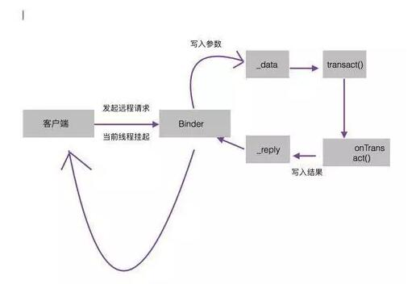

`目录：`
  - [面试题](#d11195cba9985a6572a41c4acf6edb33)
      - [Binder的工作机制](#5fc035b7e532263b4b39b6f56ffb2a04)
      - [view的事件分发和view的工作原理](#3a5638a7dd16fb97c619aef6079156bd)
      - [Android中性能优化](#dd5938704e776618f89676a78f31f072)
      - [绘制优化](#e747d57e398e39fc958cc602e6739a69)
      - [Bitmap优化： ](#68768a638f5b6c3d5645a51fd73eec35)
      - [线程优化](#dcc54a535ec16dcf8f0ac2e481a2c5e2)
      - [加密算法（base64、MD5、对称加密和非对称加密）和使用场景。](#420c922e7cf8ca839aef63fbd20b1677)
      - [Activity生命周期？](#5ddcfbba862e5e91c99c001079a0a581)
      - [Service生命周期？ ](#575f7d0682d077a310aef3d63253e395)
      - [Activity的启动过程（不要回答生命周期）](#db1a9434dab98316f2f18d0d878c109e)
      - [Broadcast注册方式与区别 此处延伸：什么情况下用动态注册](#422bb43a1e0c96962b03ae88c076cb40)
      - [HttpClient与HttpUrlConnection的区别](#28d5fc8b4f0b21c5adff471ac2d1c416)
      - [java虚拟机和Dalvik虚拟机的区别 ](#a9ec990968341011351e6465ba480613)
      - [java虚拟机运行的是java字节码。（java类会被编译成一个或多个字节码.class文件）](#a776db6fc9b057fa299670e83c63c9a0)
      - [进程保活（不死进程） 此处延伸：进程的优先级是什么](#a3c7b293d267ac1c89a1788bf32b93ef)
        - [黑色保活](#42a606b127cb95b4e0db7f1b2ed0e3ff)
        - [白色保活](#98617d5c72d64c277e34a4b757d70de4)
        - [灰色保活](#7b60c8f35a7265c45f1f581d82a262fe)
      - [讲解一下Context](#e5c7a93375629ab1df266ba6111b2ef8)
      - [ 理解Activity，View,Window三者关系](#9771de936de0792439b8c52d6b3e0e0d)
      - [四种LaunchMode及其使用场景 ](#e731db63c93e86260750baab65bcc3eb)
        - [standard 模式](#8d9e5cb7b5923daff58281b6293df03a)
      - [View的绘制流程 自定义控件：](#b17e04e020b5a03d123779c6ad3cbba1)
      - [View，ViewGroup事件分发](#403f620e4a3fc0420ade1d2429cd0fa3)
      - [保存Activity状态](#62d4f56c0f9e1a835795d620c34233c6)
      - [Android中的几种动画](#76e65e5f681275674a57b290cfedb534)
      - [Android中跨进程通讯的几种方式 ](#459413dcb7f50313cd816c07d08b3244)
      - [AIDL理解 此处延伸：简述Binder AIDL:](#3bf74ea1657f788b7f6ef24ba33c311f)

---
## 面试题

#### Binder的工作机制

直观来说，Binder是Android中的一个类，它实现了IBinder接口，从IPC的角度来说，
Binder是Android中的一种跨进程通信的一种方式，同时还可以理解为是一种虚拟的物理设备，
它的设备驱动是／dev/binder/。从Framework角度来说，Binder是ServiceManager的桥梁。
从应用层来说，Binder是客户端和服务端进行通信的媒介。

我们先来了解一下这个类中每个方法的含义：

DESCRIPTOR：Binder的唯一标识，一般用于当前Binder的类名表示。

asInterface(android.os.IBinder
obj)：用于将服务端的Binder对象转换成客户端所需的AIDL接口类型的对象，这种转化过程是区分进程的，
如果客户端和服务端位于同一个进程，那么这个方法返回的是服务端的stub对象本身，否则返回的是系统封装后的Stub.proxy对象。

asBinder()：用于返回当前Binder对象。

onTransact：该方法运行在服务端的Binder线程池中，当客户端发起跨进程通信请求的时候，
远程请求通过系统底层封装后交给该方法处理。注意这个方法public
boolean onTransact(int code, android.os.Parcel data, android.os.Parcel
reply, int
flags)，服务端通过code可以确定客户端所请求的目标方法是什么，接着从data中取出目标方法所需的参数，
然后执行目标方法。当目标方法执行完毕后，就像reply中写入返回值。这个方法的执行过程就是这样的。
如果这个方法返回false，客户端是会请求失败的，所以我们可以在这个方法中做一些安全验证。

Binder的工作机制但是要注意一些问题：

1、当客户端发起请求时，由于当前线程会被挂起，直到服务端返回数据，如果这个远程方法很耗时的话，
那么是不能够在UI线程，也就是主线程中发起这个远程请求的。
2、由于Service的Binder方法运行在线程池中，
所以Binder方法不管是耗时还是不耗时都应该采用同步的方式，因为它已经运行在一个线程中了。

#### view的事件分发和view的工作原理

Android自定义view，我们都知道实现有三部曲，onMeasure(),onLayout(),onDraw()。

View的绘制流程是从viewRoot的perfromTraversal方法开始的。它经过measure，layout，draw方法才能够将view绘制出来。
其中measure是测量宽高的，layout是确定view在父容器上的摆布位置的，draw是将view绘制到屏幕上的。

Measure:

view的测量是需要MeasureSpc(测量规格)，它代表一个32位int值，高2位代表SpecMode(测量模式)，
低（30）位的代表SpecSize(某种测量模式下的规格大小)。而一组SpecMode和SpeSize可以打包为一个MeasureSpec,
反之，MeasureSpec可以解包得到SpecMode和SpeSize的值。

`SpecMode有三类：`

`UnSpecified:`父容器不对view有任何限制，要多大有多大。一般系统用这个多。

`Exactly:`父容器已经检测出view所需要的精确大小，这个时候，view的大小就是SpecSize所指定的值，
它对应者layout布局中的math_parent或者是具体的数值

`At_most:`父容器指定了一个可用大小的SpecSize,view的大小不能够大于这个值，它对应这布局中的wrap_content.

对于普通的view，它的MeasureSpec是由父容器的MeasureSpec和自身的layoutParam共同决定的，一旦MeasureSpec确定后，
onMeasure就可以确定view的宽高了。

View的measure过程：

onMeasure方法中有个setMeasureDimension方法来设置view的宽高测量值，而setMeasureDimension有个getDefaultSize()方法作为参数。
一般情况下，我们只需要关注at_most和exactly两种情况，
getDefaultSize的返回值就是measureSpec中的SpecSize,而这个值基本就是view测量后的大小。
而UnSpecified这种情况，一般是系统内部的测量过程，它是需要考虑view的背景这些因素的。

前面说的是view的测量过程，而viewGroup的measure过程：

对于viewGroup来说，除了完成自己的measure过程以外，还要遍历去调用子类的measure方法，
各个子元素在递归执行这个过程，viewGroup是一个抽象的类，没有提供有onMeasure方法，
但是提供了一个measureChildren的方法。

measureChild方法的思想就是取出子元素的layoutParams,
然后通过getChildMeasureSpec来常见子元素的MeasureSpec,然后子元素在电泳measure方法进行测量。
由于viewGroup子类有不同的布局方式，导致他们的测量细节不一样，所以viewGroup不能象view一样调用onMeasure方法进行测量。

注意：在activity的生命周期中是没有办法正确的获取view的宽高的，原因就是view没有测量完。

在onWindowFocusChanged方法中获取 ----改方法含义是view已经初始化完毕
View.post()方法，将润那边了投递到消息队列的尾部。
使用viewTreeObserver的回调来完成。 通过view.measure方式手动测量。

onLayout

普通的view的话，可以通过setFrame方法来的到view四个顶点的位置，也就确定了view在父容器的位置，
接着就调用onLayout方法，该方法是父容器确定子元素的位置。

onDraw

该方法就是将view绘制到屏幕上。分以下几步

绘制背景，
绘制自己，
绘制child，
绘制装饰。

#### Android中性能优化

由于手机硬件的限制，内存和CPU都无法像pc一样具有超大的内存，Android手机上，过多的使用内存，会容易导致oom，
过多的使用CPU资源，会导致手机卡顿，甚至导致anr。

我主要是从一下几部分进行优化：

布局优化，绘制优化，内存泄漏优化，响应速度优化，listview优化，bitmap优化，线程优化

布局优化：工具 hierarchyviewer，解决方式： 1、删除无用的空间和层级。

2、选择性能较低的viewgroup，如Relativelayout，如果可以选择Relativelayout也可以使用LinearLayout,
就优先使用LinearLayout，因为相对来说Relativelayout功能较为复杂，会占用更多的CPU资源。

3、使用标签<include/>重用布局，<Merge/>减少层级，<viewStub/>进行预加载，使用的时候才加载。

#### 绘制优化

绘制优化指view在ondraw方法中避免大量的耗时操作，由于ondraw方法可能会被频繁的调用。

1、ondraw方法中不要创建新的局部变量，ondraw方法被频繁的调用，很容易引起GC。

2、ondraw方法不要做耗时操作。
 
内存优化：参考内存泄漏。 响应优化
主线程不能做耗时操作，触摸事件5s,广播10s，service20s。 listview优化：

1、getview方法中避免耗时操作。 

2、view的复用和viewholder的使用。

3、滑动不适合开启异步加载。 

4、分页处理数据。
 
5、图片使用三级缓存。

#### Bitmap优化： 

1、等比例压缩图片。

2、不用的图片，及时recycler掉

#### 线程优化

线程优化的思想是使用线程池来管理和复用线程，避免程序中有大量的Thread，同时可以控制线程的并发数，避免相互抢占资源而导致线程阻塞。

其他优化 

1、少用枚举，枚举占用空间大。

2、使用Android特有的数据结构，如SparseArray来代替hashMap。

3、适当的使用软引用和弱引用。

#### 加密算法（base64、MD5、对称加密和非对称加密）和使用场景。

什么是Rsa加密？

RSA算法是最流行的公钥密码算法，使用长度可以变化的密钥。RSA是第一个既能用于数据加密也能用于数字签名的算法。

RSA算法原理如下： 

1.随机选择两个大质数p和q，p不等于q，计算N=pq；

2.选择一个大于1小于N的自然数e，e必须与(p-1)(q-1)互素。

3.用公式计算出d：d×e = 1 (mod (p-1)(q-1)) 。 4.销毁p和q。

最终得到的N和e就是“公钥”，d就是“私钥”，发送方使用N去加密数据，接收方只有使用d才能解开数据内容。

RSA的安全性依赖于大数分解，小于1024位的N已经被证明是不安全的，而且由于RSA算法进行的都是大数计算，
使得RSA最快的情况也比DES慢上倍，这是RSA最大的缺陷，因此通常只能用于加密少量数据或者加密密钥，但RSA仍然不失为一种高强度的算法。

使用场景：

项目中除了登陆，支付等接口采用rsa非对称加密，之外的采用aes对称加密，今天我们来认识一下aes加密。
什么是MD5加密？ MD5英文全称“Message-Digest Algorithm
5”，翻译过来是“消息摘要算法5”，由MD2、MD3、MD4演变过来的，是一种单向加密算法，是不可逆的一种的加密方式。

MD5加密有哪些特点？
 
压缩性：任意长度的数据，算出的MD5值长度都是固定的。

容易计算：从原数据计算出MD5值很容易。

抗修改性：对原数据进行任何改动，哪怕只修改1个字节，所得到的MD5值都有很大区别。

强抗碰撞：已知原数据和其MD5值，想找到一个具有相同MD5值的数据（即伪造数据）是非常困难的。

MD5应用场景： 一致性验证 数字签名 安全访问认证 什么是aes加密？

高级加密标准（英语：Advanced Encryption
Standard，缩写：AES），在密码学中又称Rijndael加密法，是美国联邦政府采用的一种区块加密标准。
这个标准用来替代原先的DES，已经被多方分析且广为全世界所使用。

#### Activity生命周期？

onCreate() -> onStart() -> onResume() -> onPause() -> onStop() ->
onDestroy()
#### Service生命周期？ 

service启动方式有两种，一种是通过startService()方式进行启动，另一种是通过bindService()方式进行启动。
不同的启动方式他们的生命周期是不一样.

通过startService()这种方式启动的service，
生命周期是这样：调用startService() --> onCreate()--> onStartCommon()-->
onDestroy()。

这种方式启动的话，需要注意一下几个问题，第一：当我们通过startService被调用以后，
多次在调用startService(),onCreate()方法也只会被调用一次，
而onStartConmon()会被多次调用当我们调用stopService()的时候，
onDestroy()就会被调用，从而销毁服务。第二：当我们通过startService启动时候，
通过intent传值，在onStartConmon()方法中获取值的时候，一定要先判断intent是否为null。
通过bindService()方式进行绑定，这种方式绑定service，生命周期走法：bindService-->onCreate()-->onBind()-->unBind()-->onDestroy()

bingservice
这种方式进行启动service好处是更加便利activity中操作service，比如加入service中有几个方法，a,b
，如果要在activity中调用，在需要在activity获取ServiceConnection对象，通过ServiceConnection来获取service中内部类的类对象，然后通过这个类对象就可以调用类中的方法，当然这个类需要继承Binder对象
#### Activity的启动过程（不要回答生命周期）

app启动的过程有两种情况，第一种是从桌面launcher上点击相应的应用图标，第二种是在activity中通过调用startActivity来启动一个新的activity。

我们创建一个新的项目，默认的根activity都是MainActivity，而所有的activity都是保存在堆栈中的，
我们启动一个新的activity就会放在上一个activity上面，而我们从桌面点击应用图标的时候，
由于launcher本身也是一个应用，当我们点击图标的时候，系统就会调用startActivitySately(),
一般情况下，我们所启动的activity的相关信息都会保存在intent中，比如action，category等等。

我们在安装这个应用的时候，系统也会启动一个PackaManagerService的管理服务，
这个管理服务会对AndroidManifest.xml文件进行解析，从而得到应用程序中的相关信息，
比如service，activity，Broadcast等等，然后获得相关组件的信息。当我们点击应用图标的时候，
就会调用startActivitySately()方法，而这个方法内部则是调用startActivty(),
而startActivity()方法最终还是会调用startActivityForResult()这个方法。而在startActivityForResult()这个方法。
因为startActivityForResult()方法是有返回结果的，所以系统就直接给一个-1，就表示不需要结果返回了。
而startActivityForResult()这个方法实际是通过Instrumentation类中的execStartActivity()方法来启动activity，
Instrumentation这个类主要作用就是监控程序和系统之间的交互。而在这个execStartActivity()方法中会获取ActivityManagerService的代理对象，
通过这个代理对象进行启动activity。启动会就会调用一个checkStartActivityResult()方法，
如果说没有在配置清单中配置有这个组件，就会在这个方法中抛出异常了。
当然最后是调用的是Application.scheduleLaunchActivity()进行启动activity，
而这个方法中通过获取得到一个ActivityClientRecord对象，而这个ActivityClientRecord通过handler来进行消息的发送，
系统内部会将每一个activity组件使用ActivityClientRecord对象来进行描述，而ActivityClientRecord对象中保存有一个LoaderApk对象，
通过这个对象调用handleLaunchActivity来启动activity组件，而页面的生命周期方法也就是在这个方法中进行调用。
#### Broadcast注册方式与区别 此处延伸：什么情况下用动态注册

Broadcast广播，注册方式主要有两种.

第一种是静态注册，也可成为常驻型广播，这种广播需要在Androidmanifest.xml中进行注册，这中方式注册的广播，
不受页面生命周期的影响，即使退出了页面，也可以收到广播这种广播一般用于想开机自启动啊等等，
由于这种注册的方式的广播是常驻型广播，所以会占用CPU的资源。

第二种是动态注册，而动态注册的话，是在代码中注册的，这种注册方式也叫非常驻型广播，收到生命周期的影响，
退出页面后，就不会收到广播，我们通常运用在更新UI方面。这种注册方式优先级较高。最后需要解绑，否会会内存泄露
广播是分为有序广播和无序广播。
#### HttpClient与HttpUrlConnection的区别

此处延伸：Volley里用的哪种请求方式（2.3前HttpClient，2.3后HttpUrlConnection）

首先HttpClient和HttpUrlConnection

这两种方式都支持Https协议，都是以流的形式进行上传或者下载数据，也可以说是以流的形式进行数据的传输，
还有ipv6,以及连接池等功能。HttpClient这个拥有非常多的API，所以如果想要进行扩展的话，并且不破坏它的兼容性的话，
很难进行扩展，也就是这个原因，Google在Android6.0的时候，直接就弃用了这个HttpClient.

而HttpUrlConnection相对来说就是比较轻量级了，API比较少，容易扩展，并且能够满足Android大部分的数据传输。
比较经典的一个框架volley，在2.3版本以前都是使用HttpClient,在2.3以后就使用了HttpUrlConnection。
#### java虚拟机和Dalvik虚拟机的区别 

Java虚拟机： 1、java虚拟机基于栈。

基于栈的机器必须使用指令来载入和操作栈上数据，所需指令更多更多。

#### java虚拟机运行的是java字节码。（java类会被编译成一个或多个字节码.class文件）

Dalvik虚拟机： 

1、dalvik虚拟机是基于寄存器的

2、Dalvik运行的是自定义的.dex字节码格式。（java类被编译成.class文件后，会通过一个dx工具将所有的.class文件转换成一个.dex文件，
然后dalvik虚拟机会从其中读取指令和数据

3、常量池已被修改为只使用32位的索引，以简化解释器。

4、一个应用，一个虚拟机实例，一个进程（所有android应用的线程都是对应一个linux线程，都运行在自己的沙盒中，
不同的应用在不同的进程中运行。每个android
dalvik应用程序都被赋予了一个独立的linux PID(app_*)）

#### 进程保活（不死进程） 此处延伸：进程的优先级是什么

当前业界的Android进程保活手段主要分为** 黑、白、灰
**三种，其大致的实现思路如下：

黑色保活：不同的app进程，用广播相互唤醒（包括利用系统提供的广播进行唤醒）

白色保活：启动前台Service 灰色保活：利用系统的漏洞启动前台Service

##### 黑色保活

所谓黑色保活，就是利用不同的app进程使用广播来进行相互唤醒。举个3个比较常见的场景：

场景1：开机，网络切换、拍照、拍视频时候，利用系统产生的广播唤醒app

场景2：接入第三方SDK也会唤醒相应的app进程，如微信sdk会唤醒微信，支付宝sdk会唤醒支付宝。由此发散开去，就会直接触发了下面的

场景3：假如你手机里装了支付宝、淘宝、天猫、UC等阿里系的app，那么你打开任意一个阿里系的app后，
有可能就顺便把其他阿里系的app给唤醒了。（只是拿阿里打个比方，其实BAT系都差不多）

##### 白色保活

白色保活手段非常简单，就是调用系统api启动一个前台的Service进程，这样会在系统的通知栏生成一个Notification，
用来让用户知道有这样一个app在运行着，哪怕当前的app退到了后台。如下方的LBE和QQ音乐这样：

##### 灰色保活

灰色保活，这种保活手段是应用范围最广泛。它是利用系统的漏洞来启动一个前台的Service进程，
与普通的启动方式区别在于，它不会在系统通知栏处出现一个Notification，
看起来就如同运行着一个后台Service进程一样。这样做带来的好处就是，
用户无法察觉到你运行着一个前台进程（因为看不到Notification）,但你的进程优先级又是高于普通后台进程的。
那么如何利用系统的漏洞呢，大致的实现思路和代码如下：

思路一：API < 18，启动前台Service时直接传入new Notification()；

思路二：API >=
18，同时启动两个id相同的前台Service，然后再将后启动的Service做stop处理

熟悉Android系统的童鞋都知道，系统出于体验和性能上的考虑，
app在退到后台时系统并不会真正的kill掉这个进程，而是将其缓存起来。
打开的应用越多，后台缓存的进程也越多。在系统内存不足的情况下，
系统开始依据自身的一套进程回收机制来判断要kill掉哪些进程，以腾出内存来供给需要的app。这套杀进程回收内存的机制就叫
Low Memory Killer ，它是基于Linux内核的 OOM Killer（Out-Of-Memory
killer）机制诞生。 

进程的重要性，划分5级： 

前台进程 (Foreground process)

可见进程 (Visible process) 

服务进程 (Service process) 

后台进程(Background process) 

空进程 (Empty process) 

了解完 Low MemoryKiller，再科普一下oom_adj。

什么是oom_adj？它是linux内核分配给每个系统进程的一个值，代表进程的优先级，
进程回收机制就是根据这个优先级来决定是否进行回收。对于oom_adj的作用，你只需要记住以下几点即可：
进程的oom_adj越大，表示此进程优先级越低，越容易被杀回收；越小，表示进程优先级越高，越不容易被杀回收
普通app进程的oom_adj>=0,系统进程的oom_adj才可能<0

有些手机厂商把这些知名的app放入了自己的白名单中，保证了进程不死来提高用户体验
（如微信、QQ、陌陌都在小米的白名单中）。如果从白名单中移除，他们终究还是和普通app一样躲避不了被杀的命运，为了尽量避免被杀，
还是老老实实去做好优化工作吧。

所以，进程保活的根本方案终究还是回到了性能优化上，进程永生不死终究是个彻头彻尾的伪命题！

#### 讲解一下Context

Context是一个抽象基类。在翻译为上下文，也可以理解为环境，是提供一些程序的运行环境基础信息。

Context下有两个子类，ContextWrapper是上下文功能的封装类，而ContextImpl则是上下文功能的实现类。而ContextWrapper又有三个直接的子类，
ContextThemeWrapper、Service和Application。其中，ContextThemeWrapper是一个带主题的封装类，
而它有一个直接子类就是Activity，所以Activity和Service以及Application的Context是不一样的，
只有Activity需要主题，Service不需要主题。Context一共有三种类型，分别是Application、Activity和Service。
这三个类虽然分别各种承担着不同的作用，但它们都属于Context的一种，而它们具体Context的功能则是由ContextImpl类去实现的，
因此在绝大多数场景下，Activity、Service和Application这三种类型的Context都是可以通用的。不过有几种场景比较特殊，
比如启动Activity，还有弹出Dialog。出于安全原因的考虑，Android是不允许Activity或Dialog凭空出现的，
一个Activity的启动必须要建立在另一个Activity的基础之上，也就是以此形成的返回栈。而Dialog则必须在一个Activity上面弹出（除非是System
Alert类型的Dialog），因此在这种场景下，我们只能使用Activity类型的Context，否则将会出错。

getApplicationContext()和getApplication()方法得到的对象都是同一个application对象，只是对象的类型不一样。

Context数量 = Activity数量 + Service数量 + 1 （1为Application） 
####  理解Activity，View,Window三者关系

这个问题真的很不好回答。所以这里先来个算是比较恰当的比喻来形容下它们的关系吧。
Activity像一个工匠（控制单元），Window像窗户（承载模型），View像窗花（显示视图）LayoutInflater像剪刀，Xml配置像窗花图纸。

1：Activity构造的时候会初始化一个Window，准确的说是PhoneWindow。

2：这个PhoneWindow有一个“ViewRoot”，这个“ViewRoot”是一个View或者说ViewGroup，是最初始的根视图。

3：“ViewRoot”通过addView方法来一个个的添加View。比如TextView，Button等

4：这些View的事件监听，是由WindowManagerService来接受消息，并且回调Activity函数。比如onClickListener，onKeyDown等。

#### 四种LaunchMode及其使用场景 

此处延伸：栈(First In LastOut)与队列(First In First Out)的区别 栈与队列的区别：

1. 队列先进先出，栈先进后出

2. 对插入和删除操作的"限定"。 栈是限定只能在表的一端进行插入和删除操作的线性表。 
队列是限定只能在表的一端进行插入和在另一端进行删除操作的线性表。

3. 遍历数据速度不同

##### standard 模式

这是默认模式，每次激活Activity时都会创建Activity实例，并放入任务栈中。使用场景：大多数Activity。

singleTop 模式 

如果在任务的栈顶正好存在该Activity的实例，就重用该实例(
会调用实例的 onNewIntent()
)，否则就会创建新的实例并放入栈顶，即使栈中已经存在该Activity的实例，只要不在栈顶，
都会创建新的实例。使用场景如新闻类或者阅读类App的内容页面。

singleTask 模式

如果在栈中已经有该Activity的实例，就重用该实例(会调用实例的
onNewIntent()
)。重用时，会让该实例回到栈顶，因此在它上面的实例将会被移出栈。如果栈中不存在该实例，
将会创建新的实例放入栈中。使用场景如浏览器的主界面。不管从多少个应用启动浏览器，
只会启动主界面一次，其余情况都会走onNewIntent，并且会清空主界面上面的其他页面。

singleInstance 模式

在一个新栈中创建该Activity的实例，并让多个应用共享该栈中的该Activity实例。
一旦该模式的Activity实例已经存在于某个栈中，任何应用再激活该Activity时都会重用该栈中的实例(
会调用实例的 onNewIntent()
)。其效果相当于多个应用共享一个应用，不管谁激活该 Activity
都会进入同一个应用中。使用场景如闹铃提醒，将闹铃提醒与闹铃设置分离。

singleInstance不要用于中间页面，如果用于中间页面，跳转会有问题，比如：A
-> B (singleInstance) -> C，完全退出后，在此启动，首先打开的是B。 
#### View的绘制流程 自定义控件：

1、组合控件。这种自定义控件不需要我们自己绘制，而是使用原生控件组合成的新控件。如标题栏。

2、继承原有的控件。这种自定义控件在原生控件提供的方法外，可以自己添加一些方法。如制作圆角，圆形图片。

3、完全自定义控件：这个View上所展现的内容全部都是我们自己绘制出来的。比如说制作水波纹进度条。

View的绘制流程：OnMeasure()——>OnLayout()——>OnDraw()

第一步：OnMeasure()：测量视图大小。从顶层父View到子View递归调用measure方法，measure方法又回调OnMeasure。

第二步：OnLayout()：确定View位置，进行页面布局。从顶层父View向子View的递归调用view.layout方法的过程，
即父View根据上一步measure子View所得到的布局大小和布局参数，将子View放在合适的位置上。

第三步：OnDraw()：绘制视图。ViewRoot创建一个Canvas对象，然后调用OnDraw()。

六个步骤：

①、绘制视图的背景；

②、保存画布的图层（Layer）；

③、绘制View的内容；

④、绘制View子视图，如果没有就不用；

⑤、还原图层（Layer）；

⑥、绘制滚动条。
#### View，ViewGroup事件分发

1. Touch事件分发中只有两个主角:

ViewGroup和View。ViewGroup包含onInterceptTouchEvent、dispatchTouchEvent、onTouchEvent三个相关事件。
View包含dispatchTouchEvent、onTouchEvent两个相关事件。其中ViewGroup又继承于View。
2. ViewGroup和View组成了一个树状结构，根节点为Activity内部包含的一个ViwGroup。
3. 触摸事件由Action_Down、Action_Move、Aciton_UP组成，其中一次完整的触摸事件中，Down和Up都只有一个，Move有若干个，可以为0个。
4. 当Acitivty接收到Touch事件时，将遍历子View进行Down事件的分发。ViewGroup的遍历可以看成是递归的。
分发的目的是为了找到真正要处理本次完整触摸事件的View，这个View会在onTouchuEvent结果返回true。
5. 当某个子View返回true时，会中止Down事件的分发，同时在ViewGroup中记录该子View。
接下去的Move和Up事件将由该子View直接进行处理。由于子View是保存在ViewGroup中的，
多层ViewGroup的节点结构时，上级ViewGroup保存的会是真实处理事件的View所在的ViewGroup对象:如ViewGroup0-ViewGroup1-TextView的结构中，
TextView返回了true，它将被保存在ViewGroup1中，而ViewGroup1也会返回true，被保存在ViewGroup0中。
当Move和UP事件来时，会先从ViewGroup0传递至ViewGroup1，再由ViewGroup1传递至TextView。
6. 当ViewGroup中所有子View都不捕获Down事件时，将触发ViewGroup自身的onTouch事件。
触发的方式是调用super.dispatchTouchEvent函数，即父类View的dispatchTouchEvent方法。
在所有子View都不处理的情况下，触发Acitivity的onTouchEvent方法。
7. onInterceptTouchEvent有两个作用：

1.拦截Down事件的分发。

2.中止Up和Move事件向目标View传递，使得目标View所在的ViewGroup捕获Up和Move事件。
    
#### 保存Activity状态

onSaveInstanceState(Bundle)会在activity转入后台状态之前被调用，也就是onStop()方法之前，onPause方法之后被调用；
#### Android中的几种动画

`帧动画`：指通过指定每一帧的图片和播放时间，有序的进行播放而形成动画效果，比如想听的律动条。

`补间动画`：指通过指定View的初始状态、变化时间、方式，通过一系列的算法去进行图形变换，
从而形成动画效果，主要有Alpha、Scale、Translate、Rotate四种效果。

注意：只是在视图层实现了动画效果，并没有真正改变View的属性，比如滑动列表，改变标题栏的透明度。

`属性动画：`在Android3.0的时候才支持，通过不断的改变View的属性，不断的重绘而形成动画效果。
相比于视图动画，View的属性是真正改变了。比如view的旋转，放大，缩小。
#### Android中跨进程通讯的几种方式 

Android跨进程通信，像intent，contentProvider,广播，service都可以跨进程通信。

intent：这种跨进程方式并不是访问内存的形式，它需要传递一个uri,比如说打电话。

contentProvider：这种形式，是使用数据共享的形式进行数据共享。

service：远程服务，aidl 广播 
#### AIDL理解 此处延伸：简述Binder AIDL:

每一个进程都有自己的Dalvik
VM实例，都有自己的一块独立的内存，都在自己的内存上存储自己的数据，
执行着自己的操作，都在自己的那片狭小的空间里过完自己的一生。

而aidl就类似与两个进程之间的桥梁，使得两个进程之间可以进行数据的传输，跨进程通信有多种选择，比如
BroadcastReceiver , Messenger 等，但是 BroadcastReceiver
占用的系统资源比较多，如果是频繁的跨进程通信的话显然是不可取的；Messenger
进行跨进程通信时请求队列是同步进行的，无法并发执行。 

Binder机制简单理解:
在Android系统的Binder机制中，是有Client,Service,ServiceManager,Binder驱动程序组成的，其中Client，service，Service
Manager运行在用户空间，Binder驱动程序是运行在内核空间的。

而Binder就是把这4种组件粘合在一块的粘合剂，
其中核心的组件就是Binder驱动程序，Service
Manager提供辅助管理的功能，而Client和Service正是在Binder驱动程序和Service
Manager提供的基础设施上实现C/S 之间的通信。其中Binder驱动程序提供设备文件/dev/binder与用户控件进行交互，
Client、Service，Service Manager通过open和ioctl文件操作相应的方法与Binder驱动程序进行通信。
而Client和Service之间的进程间通信是通过Binder驱动程序间接实现的。而Binder
Manager是一个守护进程，用来管理Service，并向Client提供查询Service接口的能力。

