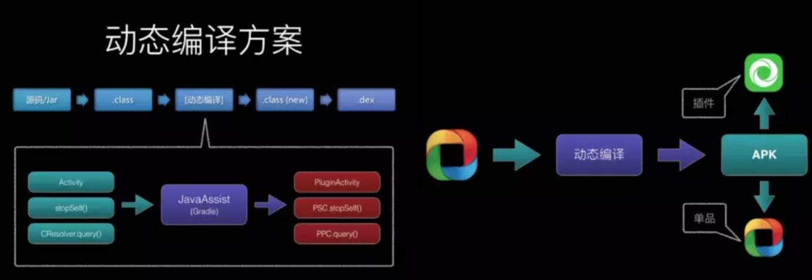
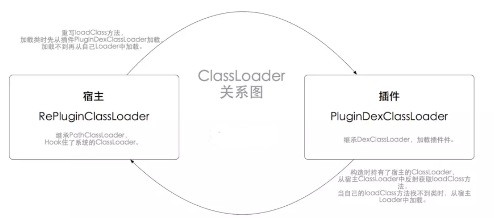
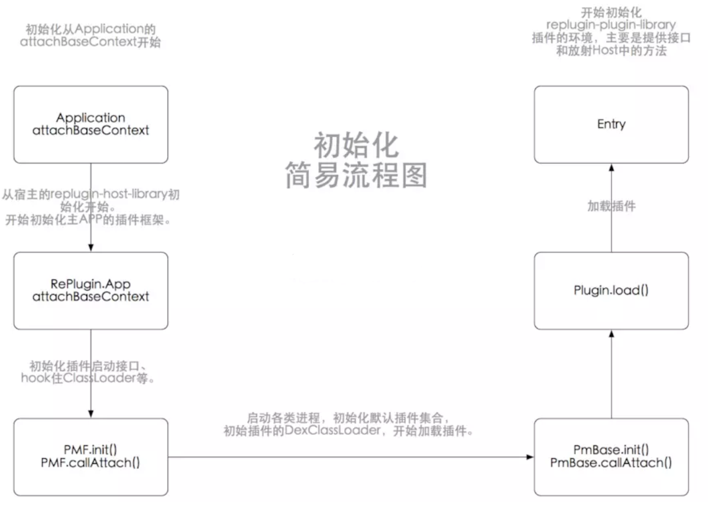
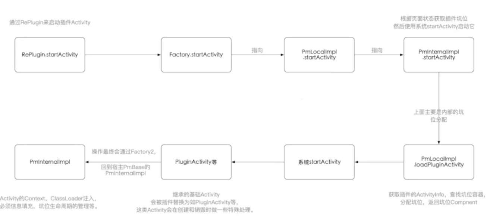

# Replugin

`简介：`

RePlugin，360开源的全面插件化框架，按照官网说的，其目的是“尽可能多的让模块变成插件”，并在很稳定的前提下，尽可能像开发普通App那样灵活。

RePlugin对比其他插件化，它的强大和特色，在于它只Hook住了ClassLoader。One
Hook这个坚持，最大程度保证了稳定性、兼容性和可维护性 。当然，One
Hook也极大的提高了实现复杂程度性，其中主要体现在：

    增加了Gradle插件脚本，实现开发中自动代码修改与生成。
    分割了插件库和宿主库的代码实现。
    初始化、加载、启动等逻辑比较复杂。


### classloader

其中常见的Loader有：

BootClassLoader 是系统启动时创建的，一般不需要用到。      
PathClassLoader 是应用启动时创建的，只能加载内部dex。        
DexClassLoader 可以加载外部的dex。

RePlugin中存在两个主要ClassLoaer：

1、RePluginClassLoader： 宿主App中的Loader，继承PathClassLoader，也是唯一Hook住系统的Loader。      
2、PluginDexClassLoader： 加载插件的Loader，继承DexClassLoader。用来做一些“更高级”的特性。

### Replugin项目原理和结构分析

`1、基础原理`

简单来说，其核心是hook住了 ClassLoader，在Activity启动前：

记录下目标页 ActivityA，替换成已自动注册在 AndroidManifest 中的坑位 ActivityNS。
在 ClassLoader 中拦截ActivityNS的创建，创建出ActivityA返回。
返回的ActivityA占用着 ActivityNS 这个坑位，坑位由Gradle编译时自动生成在AndroidManifest中。

在编译时，replugin-replugin-library脚本，会替换代码中的基础类和方法。如下图【官方原理图】所示，
替换的基类里会做一些初始化，所以这一块稍微有点入侵性。
此外，replugin-host-library会生成AndroidManifest、配置相关信息、打包等，也由Gradle插件自动完成。
打包独立APK，或者打包为插件，可单可插，这就是RePlugin。



`2、项目结构`

RePlugin整个项目结构，目前分为四个module，其中又分为两个gradle插件module，
两个library的java module

- 2.1、replugin-host-gradle :
    对应`com.qihoo360.replugin:replugin-host-gradle:xxx`依赖，主要负责在主程序的编译期中生产各类文件：
    
    根据用户的配置文件，生成HostBuildConfig类，方便插件框架读取并自定义其属性，如：进程数、各类型占位坑的数量、是否使用AppCompat库、Host版本、pulgins-builtin.json文件名、内置插件文件名等。
    自动生成带 RePlugin 插件坑位的 AndroidManifest.xml文件，文件中带有如：
    
        <activity 
           android:theme="@style/Theme.AppCompat" 
           android:name="com.qihoo360.replugin.sample.host.loader.a.ActivityN1STTS0"
           android:exported="false" 
           android:screenOrientation="portrait"
           android:configChanges="keyboard|keyboardHidden|orientation|screenSize" 
        />

- 2.2、replugin-host-library：
    对应`com.qihoo360.replugin:replugin-host-lib:xxx`依赖，是一个Java工程，由主程序负责引入，是RePlugin的核心工程，负责初始化、加载、启动、管理插件等。
- 2.3、replugin-plugin-gradle：
    对应`com.qihoo360.replugin:replugin-plugin-gradle:xxx `，是一个Gradle插件，由插件负责引入，主要负责在插件的编译期中：配置插件打包相关信息；动态替换插件工程中的继承基类，如下，修改Activity的继承、Provider的重定向等。
        
    ```
    /* LoaderActivity 替换规则 */
    def private static loaderActivityRules = [
            'android.app.Activity'                    : 'com.qihoo360.replugin.loader.a.PluginActivity',
            'android.app.TabActivity'                 : 'com.qihoo360.replugin.loader.a.PluginTabActivity',
            'android.app.ListActivity'                : 'com.qihoo360.replugin.loader.a.PluginListActivity',
            'android.app.ActivityGroup'               : 'com.qihoo360.replugin.loader.a.PluginActivityGroup',
            'android.support.v4.app.FragmentActivity' : 'com.qihoo360.replugin.loader.a.PluginFragmentActivity',
            'android.support.v7.app.AppCompatActivity': 'com.qihoo360.replugin.loader.a.PluginAppCompatActivity',
            'android.preference.PreferenceActivity'   : 'com.qihoo360.replugin.loader.a.PluginPreferenceActivity',
            'android.app.ExpandableListActivity'      : 'com.qihoo360.replugin.loader.a.PluginExpandableListActivity'
    ]
    ```
- 2.4、replugin-plugin-library：
    对应`com.qihoo360.replugin:replugin-plugin-lib:xxx`依赖，是一个Java工程，由插件端负责引入，
    主要提供通过“Java反射”来调用主程序中RePlugin Host Library的相关接口，并提供“双向通信”的能力，以及各种基类Activity等

    其中的RePlugin、RePluginInternal、PluginServiceClient都是反射宿主App ：replugin-host-library 中的 RePlugin 、 
    RePluginInternal 、PluginServiceClient 类方法。
    
### Replugin的ClassLoader

宿主和插件使用的ClassLoader，以及它们的创建和Hook住时机。
这是RePlugin唯一的Hook点，而其中插件ClassLoader和宿主ClassLoader是相互关系的。



- 1、宿主的ClassLoader      
  RePluginClassLoader，宿主的ClassLoader，继承
  PathClassLoader，构造方法使用原ClassLoader，和原ClassLoader的Parent生成。
  其中ParentLoader是因为双亲代理模型，创建ClassLoader所需，而原Loader用于保留在后期使用。
  `

    ```
    public RePluginClassLoader(ClassLoader parent, ClassLoader orig) {
        super("", "", parent);
        this.mOrig = orig;
        this.copyFromOriginal(orig);
        this.initMethods(orig);
      }
    ```
    如下两图，RePluginClassLoader 在创建时，浅拷贝原Loader的资源到 RePluginClassLoader 中，
    用于欺骗系统还处于原Loader，并且从原Loader中反射出常用方法，用于重载方法中使用。
    
    ```
    private void initMethods(ClassLoader cl) {
        Class<?> c = cl.getClass();
        this.findResourceMethod = ReflectUtils.getMethod(c, "findResource", new Class[]{String.class});
        this.findResourceMethod.setAccessible(true);
        this.findResourcesMethod = ReflectUtils.getMethod(c, "findResources", new Class[]{String.class});
        this.findResourcesMethod.setAccessible(true);
        this.findLibraryMethod = ReflectUtils.getMethod(c, "findLibrary", new Class[]{String.class});
        this.findLibraryMethod.setAccessible(true);
        this.getPackageMethod = ReflectUtils.getMethod(c, "getPackage", new Class[]{String.class});
        this.getPackageMethod.setAccessible(true);
    }
    ```
    ```
    private void copyFromOriginal(ClassLoader orig) {
        if (LogDebug.LOG && IPC.isPersistentProcess()) {
            LogDebug.d("RePluginClassLoader", "copyFromOriginal: Fields=" + StringUtils.toStringWithLines(ReflectUtils.getAllFieldsList(orig.getClass())));
        }

        if (VERSION.SDK_INT <= 10) {
            this.copyFieldValue("libPath", orig);
            this.copyFieldValue("libraryPathElements", orig);
            this.copyFieldValue("mDexs", orig);
            this.copyFieldValue("mFiles", orig);
            this.copyFieldValue("mPaths", orig);
            this.copyFieldValue("mZips", orig);
        } else {
            this.copyFieldValue("pathList", orig);
        }

    }
    ```
    
    宿主Loader中，主要是重载了 loadClass，其中从 PMF（RePlugin中公开接口类）中查找class，
    如果存在即返回插件class，如果不存在就从原Loader中加载。从而实现了对加载类的拦截。
    
    ```
     protected Class<?> loadClass(String className, boolean resolve) throws ClassNotFoundException {
        Class<?> c = null;
        c = PMF.loadClass(className, resolve);
        if (c != null) {
            return c;
        } else {
            try {
                c = this.mOrig.loadClass(className);
                if (LogDebug.LOG && RePlugin.getConfig().isPrintDetailLog()) {
                    LogDebug.d("RePluginClassLoader", "loadClass: load other class, cn=" + className);
                }

                return c;
            } catch (Throwable var5) {
                return super.loadClass(className, resolve);
            }
        }
    }
    ```
    
- 2、插件的ClassLoader      
    PluginDexClassLoader，继承DexClassLoader，构造时持有了宿主的ClassLoader，从宿主ClassLoader中反射获取loadClass方法，
    当自己的loadClass方法找不到类时，从宿主Loader中加载。
    
    ```
    public PluginDexClassLoader(PluginInfo pi, String dexPath, String optimizedDirectory, String librarySearchPath, ClassLoader parent) {
        super(dexPath, optimizedDirectory, librarySearchPath, parent);
        this.mPluginName = pi.getName();
        this.installMultiDexesBeforeLollipop(pi, dexPath, parent);
        this.mHostClassLoader = RePluginInternal.getAppClassLoader();
        initMethods(this.mHostClassLoader);
    }
    
    private static void initMethods(ClassLoader cl) {
        Class<?> clz = cl.getClass();
        if (sLoadClassMethod == null) {
            sLoadClassMethod = ReflectUtils.getMethod(clz, "loadClass", new Class[]{String.class, Boolean.TYPE});
            if (sLoadClassMethod == null) {
                throw new NoSuchMethodError("loadClass");
            }
        }

    }

    protected Class<?> loadClass(String className, boolean resolve) throws ClassNotFoundException {
        Class<?> pc = null;
        ClassNotFoundException cnfException = null;

        try {
            pc = super.loadClass(className, resolve);
            if (pc != null) {
                if (LogDebug.LOG && RePlugin.getConfig().isPrintDetailLog()) {
                    LogDebug.d("PluginDexClassLoader", "loadClass: load plugin class, cn=" + className);
                }

                return pc;
            }
        } catch (ClassNotFoundException var9) {
            cnfException = var9;
            if (PluginDexClassLoaderPatch.need2LoadFromHost(className)) {
                try {
                    return this.loadClassFromHost(className, resolve);
                } catch (ClassNotFoundException var8) {
                    cnfException = var8;
                    if (LogDebug.LOG) {
                        LogDebug.e("PluginDexClassLoader", "loadClass ClassNotFoundException, from HostClassLoader&&PluginClassLoader, cn=" + className + ", pluginName=" + this.mPluginName);
                    }
                }
            } else if (LogDebug.LOG) {
                LogDebug.e("PluginDexClassLoader", "loadClass ClassNotFoundException, from PluginClassLoader, cn=" + className + ", pluginName=" + this.mPluginName);
            }
        }

        if (RePlugin.getConfig().isUseHostClassIfNotFound()) {
            try {
                return this.loadClassFromHost(className, resolve);
            } catch (ClassNotFoundException var7) {
                cnfException = var7;
            }
        }

        if (cnfException != null) {
            throw cnfException;
        } else {
            return null;
        }
    }
    ```

- 3、创建和Hook     
  创建：上面1、2中两个Loader，是宿主在初始化时创建的，初始化时可以选择配置RePluginCallbacks，callback中提供方法默认创建Loader，
  可以实现自定义的ClassLoader，但是需要继承以上的Loader。
  
### Replugin的相关类介绍 
1. RePlugin**
   ：RePlugin的对外入口类，提供install、uninstall、preload、startActivity、fetchPackageInfo、fetchComponentList，
1. fetchClassLoader等等统一的方法入口，用户操作的主要是它。
3. RePlugin.App：RePlugin中的内部类，针对Application的入口类，所有针对插件Application的调用应从此类开始和初始化，想象成插件的Application吧。
4. PmBase：RePlugin常用mPluginMgr变量表示，可以看作插件管理者。初始化插件、加载插件等一般都是从它开始。
5. PluginContainers：插件容器管理中心。
6. PmLocalImpl：各种本地接口实现，如startActivity，getActivityInfo，loadPluginActivity等。
7. PmInternalImpl：类似Activity的接口实现，内部实现了真正startActivity的逻辑、还有插件Activity生命周期的接口。

### Replugin的初始化

`大致启动流程：`



- 1、attachBaseContext       
  首先是从 Application 的 attachBaseContext 初始化开始。这里主要是配置
  RePluginConfig 和 RePluginCallbacks ， 然后根据 Config
  去初始化插件。值得注意的是，RePluginConfig 中的 RePluginCallbacks
  提供了默认方法创建 RePlugin 的 ClassLoader;
  
  ```
    protected void attachBaseContext(Context base) {
        super.attachBaseContext(base);
        RePluginConfig c = this.createConfig();
        if (c == null) {
            c = new RePluginConfig();
        }

        RePluginCallbacks cb = this.createCallbacks();
        if (cb != null) {
            c.setCallbacks(cb);
        }

        App.attachBaseContext(this, c);
    }
  ```
- 2、插件App.attachBaseContext     
    继续上面的流程，进入RePlugin.App.attachBaseContext(this, c)，
    这里主要是初始化插件相关的进程、配置信息、插件的主框架和接口、根据默认路径、加载默认插件等。
    插件的初始化从这里开始，其中主要为 PMF.init() 和 PMF.callAttach()。
  
  ```
    public static void attachBaseContext(Application app, RePluginConfig config) {
        if (sAttached) {
            if (LogDebug.LOG) {
                LogDebug.d("RePlugin", "attachBaseContext: Already called");
            }

        } else {
            RePluginInternal.init(app);
            RePlugin.sConfig = config;
            RePlugin.sConfig.initDefaults(app);
            IPC.init(app);
            if (LogDebug.LOG && RePlugin.getConfig().isPrintDetailLog()) {
                LogDebug.printMemoryStatus("RePlugin", "act=, init, flag=, Start, pn=, framework, func=, attachBaseContext, lib=, RePlugin");
            }

            HostConfigHelper.init();
            AppVar.sAppContext = app;
            PluginStatusController.setAppContext(app);
            PMF.init(app);
            PMF.callAttach();
            sAttached = true;
        }
    }
  ```
- 3、主程序接口 PMF.init()／PMF.callAttach()       
    先进入到 PMF.init() ，这里主要实例化了 PmBase 类，并初始化了它，创建了内部使用的 PmLocalImpl 和 PmInternalImp 接口 ，
    同时Hook住主程序的 ClassLoader，替换为 RePluginClassLoader，所以接下来的流程，主要是在 PmBase 。
    
    ```
      public static final void init(Application application) {
        setApplicationContext(application);
        PluginManager.init(application);
        sPluginMgr = new PmBase(application);
        sPluginMgr.init();
        Factory.sPluginManager = getLocal();
        Factory2.sPLProxy = getInternal();
        PatchClassLoaderUtils.patch(application);
    }
    ```
    PmBase，按照项目中的变量名
    mPluginMgr，可以理解为插件的管理者，它管理内部直接或间接的，
    管理着坑位分配、ClassLoader、插件、进程、启动\停止页面的接口等。
    
    ```
        PmBase(Context context) {
        this.mContext = context;
        if (PluginManager.sPluginProcessIndex == -1 || PluginManager.isPluginProcess()) {
            String suffix;
            if (PluginManager.sPluginProcessIndex == -1) {
                suffix = "N1";
            } else {
                suffix = "" + PluginManager.sPluginProcessIndex;
            }

            this.mContainerProviders.add(IPC.getPackageName() + ".loader.p.Provider" + suffix);
            this.mContainerServices.add(IPC.getPackageName() + ".loader.s.Service" + suffix);
        }

        this.mClient = new PluginProcessPer(context, this, PluginManager.sPluginProcessIndex, this.mContainerActivities);
        this.mLocal = new PluginCommImpl(context, this);
        this.mInternal = new PluginLibraryInternalProxy(this);
    }
    ```
    PmBase 的初始化，也就是插件的初始化，这里会启动各类进程，初始化各种默认插件集合，为后续加载做准备。
    其中默认插件和配置文件的位置，一般默认是在 assert 的 plugins-builtin.json 和 "plugins" 文件夹下。
    
    ```
    void init() {
        RePlugin.getConfig().getCallbacks().initPnPluginOverride();
        if (HostConfigHelper.PERSISTENT_ENABLE) {
            if (IPC.isPersistentProcess()) {
                this.initForServer();
            } else {
                this.initForClient();
            }
        } else if (IPC.isUIProcess()) {
            this.initForServer();
            PMF.sPluginMgr.attach();
        } else {
            this.initForClient();
        }

        PluginTable.initPlugins(this.mPlugins);
        if (LogDebug.LOG) {
            Iterator var1 = this.mPlugins.values().iterator();

            while(var1.hasNext()) {
                Plugin p = (Plugin)var1.next();
                LogDebug.d("ws001", "plugin: p=" + p.mInfo);
            }
        }

    }
    ```
    接着PMF.callAttach() 其实就是 PmBase.callAttach()，如下图这里开始真正加载插件，初始化插件的 PluginDexClassLoader 、加载插件、初始化插件环境和接口。其中在执行 p.load() 的时候，会通过 Plugind.callAppLocked() 创建插件的 Application，并初始化。

    ```
    final void callAttach() {
        this.mClassLoader = PmBase.class.getClassLoader();
        Iterator var1 = this.mPlugins.values().iterator();

        while(var1.hasNext()) {
            Plugin p = (Plugin)var1.next();
            p.attach(this.mContext, this.mClassLoader, this.mLocal);
        }

        if (PluginManager.isPluginProcess() && !TextUtils.isEmpty(this.mDefaultPluginName)) {
            Plugin p = (Plugin)this.mPlugins.get(this.mDefaultPluginName);
            if (p != null) {
                boolean rc = p.load(3, true);
                if (!rc && LogDebug.LOG) {
                    LogDebug.d("ws001", "failed to load default plugin=" + this.mDefaultPluginName);
                }

                if (rc) {
                    this.mDefaultPlugin = p;
                    this.mClient.init(p);
                }
            }
        }

    }
    ```
    以上是在主APP的初始化，深入 PmBase 中，Plugin.load()在加载时，会调用PluginDexClassLoader， 
    通过类名加载 Entry 类，然后反射出create方法，执行插件的初始化。其中 Entry 位于Plugin-lib库中。
    这里初始化就去到了插件中了，插件中初始化时，会通过反射的到宿主host类的方法。
    
    ```
    public class Entry {
    
        /**
         * @param context 插件上下文
         * @param cl      HOST程序的类加载器
         * @param manager 插件管理器
         * @return
         */
        public static final IBinder create(Context context, ClassLoader cl, IBinder manager) {
            // 初始化插件框架
            RePluginFramework.init(cl);
            // 初始化Env
            RePluginEnv.init(context, cl, manager);
    
            return new IPlugin.Stub() {
                @Override
                public IBinder query(String name) throws RemoteException {
                    return RePluginServiceManager.getInstance().getService(name);
                }
            };
        }
    }
    ```
- 4、Application的onCreate        
    这里主要是切换handler到主线程，注册各种广播接收监听，如增加插件、卸载插件、更新插件，可以看出这里设计很多内部进程通信的。
    
    ```
      public static void onCreate() {
            if (!sAttached) {
                throw new IllegalStateException();
            } else if (sCreated.compareAndSet(false, true)) {
                Tasks.init();
                PMF.callAppCreate();
                if (!IPC.isPersistentProcess()) {
                    PluginInfoUpdater.register(RePluginInternal.getAppContext());
                }

                if (LogDebug.LOG && RePlugin.getConfig().isPrintDetailLog()) {
                    LogDebug.printMemoryStatus("RePlugin", "act=, init, flag=, End, pn=, framework, func=, onCreate, lib=, RePlugin");
                }

            }
        }
    ```
    
### Replugin启动Activity

`简易流程：`



- startActivity       
  从上面的流程图我们知道，启动插件Activity可以从RePlugin.startActivity开始，startActivity经历了
  Factory 、 PmLocalImpl ，其实大部分启动的逻辑其实主要在 PmInternalImpl 和
  PluginLibraryInternalProxy 中。 具体流程如下图，这里简化了实际代码，关键在于
  loadPluginActivity。这里获取了插件对应的坑位，然后保存了目标Activity的信息，通过系统启动坑位。
  因为已经Hook住了ClassLoader，在 loadClass
  时再加载出目标Activity，这样坑位中承载的，便是绕过系统打开的目标Activity。下面我们进入
  loadPluginActivity。
    
    ```
    /**
     * @hide 内部方法，插件框架使用
     * 启动一个插件中的activity，如果插件不存在会触发下载界面
     * @param context 应用上下文或者Activity上下文
     * @param intent
     * @param plugin 插件名
     * @param activity 待启动的activity类名
     * @param process 是否在指定进程中启动
     * @param download 下载
     * @return 插件机制层是否成功，例如没有插件存在、没有合适的Activity坑
     */
    public boolean startActivity(Context context, Intent intent, String plugin, String activity, int process, boolean download) {
        if (LOG) {
            LogDebug.d(PLUGIN_TAG, "start activity: intent=" + intent + " plugin=" + plugin + " activity=" + activity + " process=" + process + " download=" + download);
        }

        // 是否启动下载
        // 若插件不可用（不存在或版本不匹配），则直接弹出“下载插件”对话框
        // 因为已经打开UpdateActivity，故在这里返回True，告诉外界已经打开，无需处理
        if (download) {
            if (PluginTable.getPluginInfo(plugin) == null) {
                if (LOG) {
                    LogDebug.d(PLUGIN_TAG, "plugin=" + plugin + " not found, start download ...");
                }

                // 如果用户在下载即将完成时突然点按“取消”，则有可能出现插件已下载成功，但没有及时加载进来的情况
                // 因此我们会判断这种情况，如果是，则重新加载一次即可，反之则提示用户下载
                // 原因：“取消”会触发Task.release方法，最终调用mDownloadTask.destroy，导致“下载服务”的Receiver被注销，即使文件下载了也没有回调回来
                // NOTE isNeedToDownload方法会调用pluginDownloaded再次尝试加载
                if (isNeedToDownload(context, plugin)) {
                    return RePlugin.getConfig().getCallbacks().onPluginNotExistsForActivity(context, plugin, intent, process);
                }
            }
        }

        /* 检查是否是动态注册的类 */
        // 如果要启动的 Activity 是动态注册的类，则不使用坑位机制，而是直接动态类。
        // 原因：宿主的某些动态注册的类不能运行在坑位中（如'桌面'插件的入口Activity）
        if (LOG) {
            LogDebug.d("loadClass", "isHookingClass(" + plugin + " , " + activity + ") = "
                    + Factory2.isDynamicClass(plugin, activity));
        }

        if (Factory2.isDynamicClass(plugin, activity)) {
            intent.putExtra(IPluginManager.KEY_COMPATIBLE, true);
            intent.setComponent(new ComponentName(IPC.getPackageName(), activity));
            context.startActivity(intent);
            return true;
        }

        // 如果插件状态出现问题，则每次弹此插件的Activity都应提示无法使用，或提示升级（如有新版）
        // Added by Jiongxuan Zhang
        if (PluginStatusController.getStatus(plugin) < PluginStatusController.STATUS_OK) {
            if (LOG) {
                LogDebug.d(PLUGIN_TAG, "PluginLibraryInternalProxy.startActivity(): Plugin Disabled. pn=" + plugin);
            }
            return RePlugin.getConfig().getCallbacks().onPluginNotExistsForActivity(context, plugin, intent, process);
        }

        // 若为首次加载插件，且是“大插件”，则应异步加载，同时弹窗提示“加载中”
        // Added by Jiongxuan Zhang
        if (!RePlugin.isPluginDexExtracted(plugin)) {
            PluginDesc pd = PluginDesc.get(plugin);
            if (pd != null && pd.isLarge()) {
                if (LOG) {
                    LogDebug.d(PLUGIN_TAG, "PM.startActivity(): Large Plugin! p=" + plugin);
                }
                return RePlugin.getConfig().getCallbacks().onLoadLargePluginForActivity(context, plugin, intent, process);
            }
        }

        // WARNING：千万不要修改intent内容，尤其不要修改其ComponentName
        // 因为一旦分配坑位有误（或压根不是插件Activity），则外界还需要原封不动的startActivity到系统中
        // 可防止出现“本来要打开宿主，结果被改成插件”，进而无法打开宿主Activity的问题

        // 缓存打开前的Intent对象，里面将包括Action等内容
        Intent from = new Intent(intent);

        // 帮助填写打开前的Intent的ComponentName信息（如有。没有的情况如直接通过Action打开等）
        if (!TextUtils.isEmpty(plugin) && !TextUtils.isEmpty(activity)) {
            from.setComponent(new ComponentName(plugin, activity));
        }

        ComponentName cn = mPluginMgr.mLocal.loadPluginActivity(intent, plugin, activity, process);
        if (cn == null) {
            if (LOG) {
                LogDebug.d(PLUGIN_TAG, "plugin cn not found: intent=" + intent + " plugin=" + plugin + " activity=" + activity + " process=" + process);
            }
            return false;
        }

        // 将Intent指向到“坑位”。这样：
        // from：插件原Intent
        // to：坑位Intent
        intent.setComponent(cn);

        if (LOG) {
            LogDebug.d(PLUGIN_TAG, "start activity: real intent=" + intent);
        }
        context.startActivity(intent);

        // 通知外界，已准备好要打开Activity了
        // 其中：from为要打开的插件的Intent，to为坑位Intent
        RePlugin.getConfig().getEventCallbacks().onPrepareStartPitActivity(context, from, intent);

        return true;
    }
    ```
    
- loadPluginActivity      
  loadPluginActivity 其实是 PmBase 中的 PmLocalImpl
  内部方法。如下图，这里主要是根据获取到
  ActivityInfo，然后根据坑位去为目标Activity分配坑位。 其中 getActivityInfo
  是通过插件名称，获得插件对象 Plugin，
  Plugin可能是初始化中已加载的，如果未加载就加载返回， 然后根据 Plugin
  中缓存的坑位信息，返回 ActivityInfo。 下面进入 allocActivityContainer
  看坑位的分配，只有分配到坑位，插件的Activity才可以启动，这是一个IPC过程。
    
    ```
    /**
     * 加载插件Activity，在startActivity之前调用
     * @param intent
     * @param plugin 插件名
     * @param target 目标Service名，如果传null，则取获取到的第一个
     * @param process 是否在指定进程中启动
     * @return
     */
    public ComponentName loadPluginActivity(Intent intent, String plugin, String activity, int process) {

        ActivityInfo ai = null;
        String container = null;
        PluginBinderInfo info = new PluginBinderInfo(PluginBinderInfo.ACTIVITY_REQUEST);

        try {
            // 获取 ActivityInfo(可能是其它插件的 Activity，所以这里使用 pair 将 pluginName 也返回)
            ai = getActivityInfo(plugin, activity, intent);
            if (ai == null) {
                if (LOG) {
                    LogDebug.d(PLUGIN_TAG, "PACM: bindActivity: activity not found");
                }
                return null;
            }

            // 存储此 Activity 在插件 Manifest 中声明主题到 Intent
            intent.putExtra(INTENT_KEY_THEME_ID, ai.theme);
            if (LOG) {
                LogDebug.d("theme", String.format("intent.putExtra(%s, %s);", ai.name, ai.theme));
            }

            // 根据 activity 的 processName，选择进程 ID 标识
            if (ai.processName != null) {
                process = PluginClientHelper.getProcessInt(ai.processName);
            }

            // 容器选择（启动目标进程）
            IPluginClient client = MP.startPluginProcess(plugin, process, info);
            if (client == null) {
                return null;
            }

            // 远程分配坑位
            container = client.allocActivityContainer(plugin, process, ai.name, intent);
            if (LOG) {
                LogDebug.i(PLUGIN_TAG, "alloc success: container=" + container + " plugin=" + plugin + " activity=" + activity);
            }
        } catch (Throwable e) {
            if (LOGR) {
                LogRelease.e(PLUGIN_TAG, "l.p.a spp|aac: " + e.getMessage(), e);
            }
        }

        // 分配失败
        if (TextUtils.isEmpty(container)) {
            return null;
        }

        PmBase.cleanIntentPluginParams(intent);

        // TODO 是否重复
        // 附上额外数据，进行校验
        PluginIntent ii = new PluginIntent(intent);
        ii.setPlugin(plugin);
        ii.setActivity(ai.name);
        ii.setProcess(IPluginManager.PROCESS_AUTO);
        ii.setContainer(container);
        ii.setCounter(0);
        return new ComponentName(IPC.getPackageName(), container);
    }
    ```
    
- allocActivityContainer      
  allocActivityContainer 在类 PluginProcessPer 中，还记得我们在
  PmBase.init() 时初始化过它么？ 分配坑位也是RePlugin的核心之一。 在
  allocActivityContainer 中， 主要逻辑是bindActivity ，如下图，bindActivity
  去找到目标Activity匹配的容器，然后加载目标Activity判断是否存在，并建立映射，返回容器。然后分配的逻辑，在
  PluginContainers.alloc 中。
  
  ```
  /**
     * 加载插件；找到目标Activity；搜索匹配容器；加载目标Activity类；建立临时映射；返回容器
     *
     * @param plugin   插件名称
     * @param process  进程
     * @param activity Activity 名称
     * @param intent   调用者传入的 Intent
     * @return 坑位
     */
    final String bindActivity(String plugin, int process, String activity, Intent intent) {

        /* 获取插件对象 */
        Plugin p = mPluginMgr.loadAppPlugin(plugin);
        if (p == null) {
            if (LOG) {
                LogDebug.w(PLUGIN_TAG, "PACM: bindActivity: may be invalid plugin name or load plugin failed: plugin=" + plugin);
            }
            return null;
        }

        /* 获取 ActivityInfo */
        ActivityInfo ai = p.mLoader.mComponents.getActivity(activity);
        if (ai == null) {
            if (LOG) {
                LogDebug.d(PLUGIN_TAG, "PACM: bindActivity: activity not found: activity=" + activity);
            }
            return null;
        }

        if (ai.processName == null) {
            ai.processName = ai.applicationInfo.processName;
        }
        if (ai.processName == null) {
            ai.processName = ai.packageName;
        }

        /* 获取 Container */
        String container;

        // 自定义进程
        if (ai.processName.contains(PluginProcessHost.PROCESS_PLUGIN_SUFFIX2)) {
            String processTail = PluginProcessHost.processTail(ai.processName);
            container = mACM.alloc2(ai, plugin, activity, process, intent, processTail);
        } else {
            container = mACM.alloc(ai, plugin, activity, process, intent);
        }

        if (TextUtils.isEmpty(container)) {
            if (LOG) {
                LogDebug.w(PLUGIN_TAG, "PACM: bindActivity: activity container is empty");
            }
            return null;
        }

        if (LOG) {
            LogDebug.d(PLUGIN_TAG, "PACM: bindActivity: lookup activity container: container=" + container);
        }

        /* 检查 activity 是否存在 */
        Class<?> c = null;
        try {
            c = p.mLoader.mClassLoader.loadClass(activity);
        } catch (Throwable e) {
            if (LOGR) {
                LogRelease.e(PLUGIN_TAG, e.getMessage(), e);
            }
        }
        if (c == null) {
            if (LOG) {
                LogDebug.w(PLUGIN_TAG, "PACM: bindActivity: plugin activity class not found: c=" + activity);
            }
            return null;
        }

        return container;
    }
  ```
  
- PluginContainers.alloc alloc / alloc2         
    方法分配坑位，最后都是到了
    allocLocked 方法中，其实RePlugin中，如下图，便是坑位分配的逻辑：

    如果存在未启动的坑位，就使用它。
    如果没有就找最老的：已经被释放的、或者时间最老的。
    如果还不行，那么挤掉最老的一个。

  ```
   /**
     * @param ai
     * @param map
     * @param plugin
     * @param activity
     * @param intent
     * @return
     */
    private final ActivityState allocLocked(ActivityInfo ai, HashMap<String, ActivityState> map,
                                            String plugin, String activity, Intent intent) {
        // 坑和状态的 map 为空
        if (map == null) {
            if (LOG) {
                LogDebug.d(PLUGIN_TAG, "PACM: alloc fail, map is null");
            }
            return null;
        }

        // 首先找上一个活的，或者已经注册的，避免多个坑到同一个activity的映射
        for (ActivityState state : map.values()) {
            if (state.isTarget(plugin, activity)) {
                if (LOG) {
                    LogDebug.d(PLUGIN_TAG, "PACM: alloc registered container=" + state.container);
                }
                return state;
            }
        }

        // 新分配：找空白的，第一个
        for (ActivityState state : map.values()) {
            if (state.state == STATE_NONE) {
                if (LOG) {
                    LogDebug.d(PLUGIN_TAG, "PACM: alloc empty container=" + state.container);
                }
                state.occupy(plugin, activity);
                return state;
            }
        }

        ActivityState found;

        // 重用：则找最老的那个
        found = null;
        for (ActivityState state : map.values()) {
            if (!state.hasRef()) {
                if (found == null) {
                    found = state;
                } else if (state.timestamp < found.timestamp) {
                    found = state;
                }
            }
        }
        if (found != null) {
            if (LOG) {
                LogDebug.d(PLUGIN_TAG, "PACM: alloc recycled container=" + found.container);
            }
            found.occupy(plugin, activity);
            return found;
        }

        // 强挤：最后一招，挤掉：最老的那个
        found = null;
        for (ActivityState state : map.values()) {
            if (found == null) {
                found = state;
            } else if (state.timestamp < found.timestamp) {
                found = state;
            }
        }
        if (found != null) {
            if (LOG) {
                LogDebug.w(PLUGIN_TAG, "PACM: force alloc container=" + found.container);
            }
            found.finishRefs();
            found.occupy(plugin, activity);
            return found;
        }

        if (LOG) {
            LogDebug.w(PLUGIN_TAG, "PACM: alloc failed: plugin=" + plugin + " activity=" + activity);
        }

        // never reach here
        return null;
    }
  ```
  
- PulginActivity
    上面的流程总结，是替换目标Activity，加载插件，分配坑位，启动目标坑位，拦截ClassLoader的loadClass去加载返回目标Activity。
    这个时候启动的Activity还不完整，从模块框架中我们知道，在编译时，RePlugin会把继承的Activity替换为如 
    PluginActivity（当前还有AppComPluginActivity等）。这时候加载启动的目标Activity，其实是继承了 PluginActivity。
    如下图， PluginActivity 重载Activity中的一些方法，实现了Activity的补全和自定义操作，如坑位管理，启动宿主Activity等。
    
    ```
        public abstract class PluginActivity extends Activity {
    
        @Override
        protected void attachBaseContext(Context newBase) {
            newBase = RePluginInternal.createActivityContext(this, newBase);
            super.attachBaseContext(newBase);
        }
    
        @Override
        protected void onCreate(Bundle savedInstanceState) {
            //
            RePluginInternal.handleActivityCreateBefore(this, savedInstanceState);
    
            super.onCreate(savedInstanceState);
    
            //
            RePluginInternal.handleActivityCreate(this, savedInstanceState);
        }
    
        @Override
        protected void onDestroy() {
            //
            RePluginInternal.handleActivityDestroy(this);
    
            super.onDestroy();
        }
    
        @Override
        protected void onRestoreInstanceState(Bundle savedInstanceState) {
            //
            RePluginInternal.handleRestoreInstanceState(this, savedInstanceState);
    
            try {
                super.onRestoreInstanceState(savedInstanceState);
            } catch (Throwable e) {
                // Added by Jiongxuan Zhang
                // Crash Hash: B1F67129BC6A67C882AF2BBE62202BF0
                // java.lang.IllegalArgumentException: Wrong state class异常
                // 原因：恢复现场时，Activity坑位找错了。通常是用于占坑的Activity的层级过深导致
                // 举例：假如我们只有一个坑位可用，A和B分别是清理和通讯录的两个Activity
                //      如果进程重启，系统原本恢复B，却走到了A，从而出现此问题
                // 解决：将其Catch住，这样系统在找ViewState时不会出错。
                // 后遗症：
                // 1、可能无法恢复系统级View的保存的状态；
                // 2、如果自己代码处理不当，可能会出现异常。故自己代码一定要用SecExtraUtils来获取Bundle数据
                if (LogRelease.LOGR) {
                    LogRelease.e("PluginActivity", "o r i s: p=" + getPackageCodePath() + "; " + e.getMessage(), e);
                }
            }
        }
    
        @Override
        public void startActivity(Intent intent) {
            //
            if (RePluginInternal.startActivity(this, intent)) {
                // 这个地方不需要回调startActivityAfter，因为Factory2最终还是会回调回来，最终还是要走super.startActivity()
                return;
            }
    
            super.startActivity(intent);
        }
    
        @Override
        public void startActivityForResult(Intent intent, int requestCode) {
            //
            if (RePluginInternal.startActivityForResult(this, intent, requestCode)) {
                // 这个地方不需要回调startActivityAfter，因为Factory2最终还是会回调回来，最终还是要走super.startActivityForResult()
                return;
            }
    
            super.startActivityForResult(intent, requestCode);
    
        }
    }
    ```
    
    至此，一个插件Activity就启动起来了


