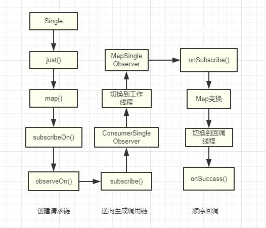

# Rxjava 源码分析一

## 分析Single类链式调用的流程

`简单分析数据变换map，线程切换：` 

代码如下
```
public static void main (String[] args) {
        Disposable subscribe = Single.just(1).map(new Function<Integer, String>() {
            public String apply (Integer integer) throws Exception {
                System.out.println("map -> "+integer);
                return "map -> " + integer;
            }
        }).subscribeOn(Schedulers.io())
                .observeOn(Schedulers.newThread())
                .subscribe(new Consumer<String>() {
                    public void accept (String s) throws Exception {
                        System.out.println("success -> "+s);
                    }
                }, new Consumer<Throwable>() {
                    public void accept (Throwable throwable) throws Exception {
                        System.out.println("error -> "+throwable.getMessage());
                    }
                });
        try{
            Thread.sleep(500L);
        } catch (InterruptedException e){
            e.printStackTrace();
        }
    }
```

rxjava触发任务执行的条件--调用subscribe()，所以分两步来说明调用过程：

### subscribe()调用前
1.Single.just()创建SingleJust对象：
```
  public static <T> Single<T> just(final T item) {
        ObjectHelper.requireNonNull(item, "item is null");
        return RxJavaPlugins.onAssembly(new SingleJust<T>(item));
    }
```
2.SingleJust.map()创建SingleMap对象，添加mapper： 
```
  public final <R> Single<R> map(Function<? super T, ? extends R> mapper) {
        ObjectHelper.requireNonNull(mapper, "mapper is null");
        return RxJavaPlugins.onAssembly(new SingleMap<T, R>(this, mapper));
    }
```
3.SingleMap创建SingleSubscribeOn对象，指定工作时的线程： 
```
 public final Single<T> subscribeOn(final Scheduler scheduler) {
        ObjectHelper.requireNonNull(scheduler, "scheduler is null");
        return RxJavaPlugins.onAssembly(new SingleSubscribeOn<T>(this, scheduler));
    }
```
4.SingleSubscribeOn创建SingleObserveOn对象，指定回调接口处理的线程： 
```
  public final Single<T> observeOn(final Scheduler scheduler) {
        ObjectHelper.requireNonNull(scheduler, "scheduler is null");
        return RxJavaPlugins.onAssembly(new SingleObserveOn<T>(this, scheduler));
    }
```
构建完毕

### subscribe()调用后

SingleObserveOn调用subscribe(onSuccess, onError),执行父类Single#subscribe(onSuccess, onError)：
```
 public final Disposable subscribe(final Consumer<? super T> onSuccess, final Consumer<? super Throwable> onError) {
        ObjectHelper.requireNonNull(onSuccess, "onSuccess is null");
        ObjectHelper.requireNonNull(onError, "onError is null");

        ConsumerSingleObserver<T> observer = new ConsumerSingleObserver<T>(onSuccess, onError);
        subscribe(observer);
        return observer;
    }
    
```
ConsumerSingleObserver
```
public final class ConsumerSingleObserver<T>
extends AtomicReference<Disposable>
implements SingleObserver<T>, Disposable, LambdaConsumerIntrospection {

    private static final long serialVersionUID = -7012088219455310787L;

    final Consumer<? super T> onSuccess;

    final Consumer<? super Throwable> onError;

    public ConsumerSingleObserver(Consumer<? super T> onSuccess, Consumer<? super Throwable> onError) {
        this.onSuccess = onSuccess;
        this.onError = onError;
    }

    @Override
    public void onError(Throwable e) {
        lazySet(DisposableHelper.DISPOSED);
        try {
            onError.accept(e);
        } catch (Throwable ex) {
            Exceptions.throwIfFatal(ex);
            RxJavaPlugins.onError(new CompositeException(e, ex));
        }
    }

    @Override
    public void onSubscribe(Disposable d) {
        DisposableHelper.setOnce(this, d);
    }

    @Override
    public void onSuccess(T value) {
        lazySet(DisposableHelper.DISPOSED);
        try {
            onSuccess.accept(value);
        } catch (Throwable ex) {
            Exceptions.throwIfFatal(ex);
            RxJavaPlugins.onError(ex);
        }
    }

    @Override
    public void dispose() {
        DisposableHelper.dispose(this);
    }

    @Override
    public boolean isDisposed() {
        return get() == DisposableHelper.DISPOSED;
    }

    @Override
    public boolean hasCustomOnError() {
        return onError != Functions.ON_ERROR_MISSING;
    }
}
```
-> 创建ConsumerSingleObserver观察者，并且调用Single#subscribe(observer)
```
 public final void subscribe(SingleObserver<? super T> observer) {
        ObjectHelper.requireNonNull(observer, "observer is null");

        observer = RxJavaPlugins.onSubscribe(this, observer);

        ObjectHelper.requireNonNull(observer, "The RxJavaPlugins.onSubscribe hook returned a null SingleObserver. Please check the handler provided to RxJavaPlugins.setOnSingleSubscribe for invalid null returns. Further reading: https://github.com/ReactiveX/RxJava/wiki/Plugins");

        try {
            subscribeActual(observer);
        } catch (NullPointerException ex) {
            throw ex;
        } catch (Throwable ex) {
            Exceptions.throwIfFatal(ex);
            NullPointerException npe = new NullPointerException("subscribeActual failed");
            npe.initCause(ex);
            throw npe;
        }
    }
```
-> 调用SingleObserveOn#subscribeActual(observer)
```
 protected void subscribeActual(final SingleObserver<? super T> observer) {
        source.subscribe(new ObserveOnSingleObserver<T>(observer, scheduler));
    }
```
-> 创建ObserveOnSingleObserver观察者，并将上一个SingleObserver
（在这里就是指ConsumerSingleObserver）存起来
```
static final class ObserveOnSingleObserver<T> extends AtomicReference<Disposable>
    implements SingleObserver<T>, Disposable, Runnable {
        private static final long serialVersionUID = 3528003840217436037L;

        final SingleObserver<? super T> downstream;

        final Scheduler scheduler;

        T value;
        Throwable error;

        ObserveOnSingleObserver(SingleObserver<? super T> actual, Scheduler scheduler) {
            this.downstream = actual;
            this.scheduler = scheduler;
        }

        @Override
        public void onSubscribe(Disposable d) {
            if (DisposableHelper.setOnce(this, d)) {
                downstream.onSubscribe(this);
            }
        }

        @Override
        public void onSuccess(T value) {
            this.value = value;
            Disposable d = scheduler.scheduleDirect(this);
            DisposableHelper.replace(this, d);
        }

        @Override
        public void onError(Throwable e) {
            this.error = e;
            Disposable d = scheduler.scheduleDirect(this);
            DisposableHelper.replace(this, d);
        }

        @Override
        public void run() {
            Throwable ex = error;
            if (ex != null) {
                downstream.onError(ex);
            } else {
                downstream.onSuccess(value);
            }
        }

        @Override
        public void dispose() {
            DisposableHelper.dispose(this);
        }

        @Override
        public boolean isDisposed() {
            return DisposableHelper.isDisposed(get());
        }
    }
```
->
source现在是SingleSubscribeOn类，调用subscribe(observer)调用Single#subscribe(observer)，即又调了
SingleSubscribeOn#subscribeActual()
```
 protected void subscribeActual(final SingleObserver<? super T> observer) {
        final SubscribeOnObserver<T> parent = new SubscribeOnObserver<T>(observer, source);
        observer.onSubscribe(parent);

        Disposable f = scheduler.scheduleDirect(parent);

        parent.task.replace(f);

    }
```
SubscribeOnObserver实现了Runnable接口
```
static final class SubscribeOnObserver<T>
    extends AtomicReference<Disposable>
    implements SingleObserver<T>, Disposable, Runnable {

        private static final long serialVersionUID = 7000911171163930287L;

        final SingleObserver<? super T> downstream;

        final SequentialDisposable task;

        final SingleSource<? extends T> source;

        SubscribeOnObserver(SingleObserver<? super T> actual, SingleSource<? extends T> source) {
            this.downstream = actual;
            this.source = source;
            this.task = new SequentialDisposable();
        }

        @Override
        public void onSubscribe(Disposable d) {
            DisposableHelper.setOnce(this, d);
        }

        @Override
        public void onSuccess(T value) {
            downstream.onSuccess(value);
        }

        @Override
        public void onError(Throwable e) {
            downstream.onError(e);
        }

        @Override
        public void dispose() {
            DisposableHelper.dispose(this);
            task.dispose();
        }

        @Override
        public boolean isDisposed() {
            return DisposableHelper.isDisposed(get());
        }

        @Override
        public void run() {
            source.subscribe(this);
        }
    }
```
-> 创建了SubscribeOnObserver观察者，并且持有ConsumerSingleObserver和SingleMap;
调用ObserveOnSingleObserver#onSubscribe(d)；然后执行scheduler.scheduleDirect(parent)，
即在订阅的线程中处理SubscribeOnObserver；
```
   public Disposable scheduleDirect(@NonNull Runnable run, long delay, @NonNull TimeUnit unit) {
        final Worker w = createWorker();

        final Runnable decoratedRun = RxJavaPlugins.onSchedule(run);

        DisposeTask task = new DisposeTask(decoratedRun, w);

        w.schedule(task, delay, unit);

        return task;
    }
```
其中Disposable对象是用于防止任务重复提交和执行等操作的； -> 任务执行后，
SubscribeOnObserver会执行Runnable()方法
```
   @Override
        public void run() {
            source.subscribe(this);
        }
```
-> 所以，调用SingleMap#subscribe(subscribeOnObserver)，source是SingleMap类，即
Single#subscribe(subscribeOnObserver)，调用了SingleMap#subscribeActual(subscribeOnObserver)
```
 @Override
    protected void subscribeActual(final SingleObserver<? super R> t) {
        source.subscribe(new MapSingleObserver<T, R>(t, mapper));
    }
```
-> 又创建了MapSingleObserver对象,此时source是SingleJust类
```
static final class MapSingleObserver<T, R> implements SingleObserver<T> {

        final SingleObserver<? super R> t;

        final Function<? super T, ? extends R> mapper;

        MapSingleObserver(SingleObserver<? super R> t, Function<? super T, ? extends R> mapper) {
            this.t = t;
            this.mapper = mapper;
        }

        @Override
        public void onSubscribe(Disposable d) {
            t.onSubscribe(d);
        }

        @Override
        public void onSuccess(T value) {
            R v;
            try {
                v = ObjectHelper.requireNonNull(mapper.apply(value), "The mapper function returned a null value.");
            } catch (Throwable e) {
                Exceptions.throwIfFatal(e);
                onError(e);
                return;
            }

            t.onSuccess(v);
        }

        @Override
        public void onError(Throwable e) {
            t.onError(e);
        }
    }
```
-> 所以，间接到了SingleJust#subscribeActual(observer)中
```
 protected void subscribeActual(SingleObserver<? super T> observer) {
        observer.onSubscribe(Disposables.disposed());
        observer.onSuccess(value);
    }
```
->
此时的observer是MapSingleObserver类，至此，Observer完整的调用链构建完毕，从SingleJust#subscribeActual(observer)开始从顶层调用Observer

### 调用onSubscribe(disposable)
MapSingleObserver#onSubscribe(disposable), t是SubscribeOnObserver类
```
 public void onSubscribe(Disposable d) {
            t.onSubscribe(d);
        }
```
-> SubscribeOnObserver#onSubscribe(disposable),
t是SubscribeOnObserver类,确保执行当前的任务
```
 public void onSubscribe(Disposable d) {
            DisposableHelper.setOnce(this, d);
        }
```
-> MapSingleObserver#onSuccess(value), t是SubscribeOnObserver类 

-> SubscribeOnObserver#onSuccess(value),
downstream是ObserveOnSingleObserver类
```
  public void onSuccess(T value) {
            downstream.onSuccess(value);
        }
```
-> ObserveOnSingleObserver#onSuccess(value),
在此切换为回调结果的线程中处理
```
  public void onSuccess(T value) {
            this.value = value;
            Disposable d = scheduler.scheduleDirect(this);
            DisposableHelper.replace(this, d);
        }
```
-> 外部回调结果在run()方法中处理，此时线程已经切换
```
   public void run() {
            Throwable ex = error;
            if (ex != null) {
                downstream.onError(ex);
            } else {
                downstream.onSuccess(value);
            }
        
```
完毕...

### 流程




