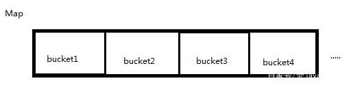
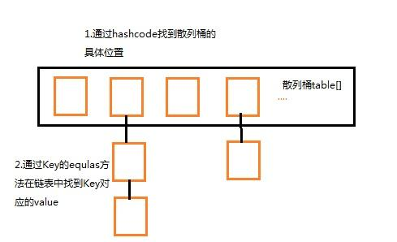

`目录：`
- [HashMap
](#ddd7c1ae07003e250b5a7388ce52757e)
  - [HashMap是什么
](#3a8d5eb7363a88271538dee62155b4e0)
  - [HashMap的工作原理是什么？
](#e959731d1fb70f4e0fc1bd91c4d7fb4d)
    - [HashMap初始化 
](#92c96c7bb81ae69c3e78daf52da37f1f)
    - [put过程
](#0b772f0c5547bfc9434f17601334d468)
    - [get过程
](#07de707592e5d20177cfd3e1f70d7dd5)
  - [有什么方法可以减少碰撞？
](#067f572801cbe6c611271f0790d96544)
  - [HashMap中hash函数怎么是是实现的?
](#89596176ccd6ead5cf9d511199ec9e98)
  - [拉链法导致的链表过深问题为什么不用二叉查找树代替，而选择红黑树？为什么不一直使用红黑树？
](#ed845aee4e9bbf3df6edc8ab5ee96a8a)
  - [解决hash 碰撞还有那些办法？
](#10bd2236d28837974f8c19423621c730)
  - [如果HashMap的大小超过了负载因子(load factor)定义的容量，怎么办？
](#932072504b0e7ce919a9b212050f7085)
  - [重新调整HashMap大小存在什么问题吗？
](#e88729a3252314e6551fa06ee2f3c062)

---
# <span id="ddd7c1ae07003e250b5a7388ce52757e"/>HashMap


## <span id="3a8d5eb7363a88271538dee62155b4e0"/>HashMap是什么


HashMap是一个散列桶（数组和链表），它存储的内容是键值对(key-value)映射

HashMap采用了数组和链表的数据结构，能在查询和修改方便继承了数组的线性查找和链表的寻址修改

HashMap是非synchronized，所以HashMap很快

HashMap可以接受null键和值，而Hashtable则不能（原因就是equlas()方法需要对象，因为HashMap是后出的API经过处理才可以）

## <span id="e959731d1fb70f4e0fc1bd91c4d7fb4d"/>HashMap的工作原理是什么？


HashMap是基于hashing的原理，我们使用put(key, value)存储对象到HashMap中，使用get(key)从HashMap中获取对象。
当我们给put()方法传递键和值时，我们先对键调用hashCode()方法，计算并返回的hashCode是用于找到Map数组的bucket位置来储存Node 对象。
这里关键点在于指出，HashMap是在bucket中储存键对象和值对象，作为Map.Node 。



### <span id="92c96c7bb81ae69c3e78daf52da37f1f"/>HashMap初始化 

简单模拟数据结构
 
```
Node[] table=new Node[16]//散列桶初始化， 
Node {
    hash;//hash值 
    key;//键 
    value;//值 
    next;//用于指向链表的下一层（产生冲突，用拉链法）
}
```
### <span id="0b772f0c5547bfc9434f17601334d468"/>put过程


1、对Key求Hash值，然后再计算下标

2、如果没有碰撞，直接放入桶中（碰撞的意思是计算得到的Hash值相同，需要放到同一个bucket中）

3、如果碰撞了，以链表的方式链接到后面

4、如果链表长度超过阀值( TREEIFY THRESHOLD==8)，就把链表转成红黑树，链表长度低于6，就把红黑树转回链表

5、如果节点已经存在就替换旧值

6、如果桶满了(容量16*加载因子0.75)，就需要 resize（扩容2倍后重排）

### <span id="07de707592e5d20177cfd3e1f70d7dd5"/>get过程

(考虑特殊情况如果两个键的hashcode相同，你如何获取值对象？)
当我们调用get()方法，HashMap会使用键对象的hashcode找到bucket位置，找到bucket位置之后，
会调用keys.equals()方法去找到链表中正确的节点，最终找到要找的值对象。



## <span id="067f572801cbe6c611271f0790d96544"/>有什么方法可以减少碰撞？

- 扰动函数可以减少碰撞，原理是如果两个不相等的对象返回不同的hashcode的话，那么碰撞的几率就会小些，
这就意味着存链表结构减小，这样取值的话就不会频繁调用equal方法，这样就能提高HashMap的性能。
（扰动即Hash方法内部的算法实现，目的是让不同对象返回不同hashcode。）
- 使用不可变的、声明作final的对象，并且采用合适的equals()和hashCode()方法的话，将会减少碰撞的发生。
  不可变性使得能够缓存不同键的hashcode，这将提高整个获取对象的速度，使用String，Integer这样的wrapper类作为键是非常好的选择。
  为什么String,Integer这样的wrapper类适合作为键？因为String是final的，而且已经重写了equals()和hashCode()方法了。
  不可变性是必要的，因为为了要计算hashCode()，就要防止键值改变，如果键值在放入时和获取时返回不同的hashcode的话，
  那么就不能从HashMap中找到你想要的对象。
  
## <span id="89596176ccd6ead5cf9d511199ec9e98"/>HashMap中hash函数怎么是是实现的?


我们可以看到在hashmap中要找到某个元素，需要根据key的hash值来求得对应数组中的位置。如何计算这个位置就是hash算法。
前面说过hashmap的数据结构是数组和链表的结合，所以我们当然希望这个hashmap里面的元素位置尽量的分布均匀些，
尽量使得每个位置上的元素数量只有一个，那么当我们用hash算法求得这个位置的时候，
马上就可以知道对应位置的元素就是我们要的，而不用再去遍历链表。 所以我们首先想到的就是把hashcode对数组长度取模运算，
这样一来，元素的分布相对来说是比较均匀的。但是，“模”运算的消耗还是比较大的，能不能找一种更快速，消耗更小的方式，

```
 static final int hash(Object key) {
        int h;
        return (key == null) ? 0 : (h = key.hashCode()) ^ (h >>> 16);
    }
```
 


简单来说就是

1、高16bit不变，低16bit和高16bit做了一个异或(得到的HASHCODE转化为32位的二进制，前16位和后16位低16bit和高16bit做了一个异或)

2、(n·1)&hash=->得到下标

## <span id="ed845aee4e9bbf3df6edc8ab5ee96a8a"/>拉链法导致的链表过深问题为什么不用二叉查找树代替，而选择红黑树？为什么不一直使用红黑树？


之所以选择红黑树是为了解决二叉查找树的缺陷，二叉查找树在特殊情况下会变成一条线性结构（这就跟原来使用链表结构一样了，造成很深的问题），
遍历查找会非常慢。而红黑树在插入新数据后可能需要通过左旋，右旋、变色这些操作来保持平衡，
引入红黑树就是为了查找数据快，解决链表查询深度的问题，我们知道红黑树属于平衡二叉树，
但是为了保持“平衡”是需要付出代价的，但是该代价所损耗的资源要比遍历线性链表要少，
所以当长度大于8的时候，会使用红黑树，如果链表长度很短的话，根本不需要引入红黑树，引入反而会慢。

## <span id="10bd2236d28837974f8c19423621c730"/>解决hash 碰撞还有那些办法？


开放定址法。

当冲突发生时，使用某种探查技术在散列表中形成一个探查(测)序列。沿此序列逐个单元地查找，直到找到给定的地址。

按照形成探查序列的方法不同，可将开放定址法区分为线性探查法、二次探查法、双重散列法等。

下面给一个线性探查法的例子    

`问题：`已知一组关键字为(26，36，41，38，44，15，68，12，06，51)，
用除余法构造散列函数，用线性探查法解决冲突构造这组关键字的散列表。

`解答：`为了减少冲突，通常令装填因子α由除余法因子是13的散列函数计算出的上述关键字序列的散列地址为(0，10，2，12，5，2，3，12，6，12)。

前5个关键字插入时，其相应的地址均为开放地址，故将它们直接插入T[0]，T[10)，T[2]，T[12]和T[5]中。

当插入第6个关键字15时，其散列地址2(即h(15)=15％13=2)已被关键字41(15和41互为同义词)占用。
故探查h1=(2+1)％13=3，此地址开放，所以将15放入T[3]中。

当插入第7个关键字68时，其散列地址3已被非同义词15先占用，故将其插入到T[4]中。

当插入第8个关键字12时，散列地址12已被同义词38占用，故探查hl=(12+1)％13=0，
而T[0]亦被26占用，再探查h2=(12+2)％13=1，此地址开放，可将12插入其中。

类似地，第9个关键字06直接插入T[6]中；而最后一个关键字51插人时，因探查的地址12，0，1，…，6均非空，故51插入T[7]中。

## <span id="932072504b0e7ce919a9b212050f7085"/>如果HashMap的大小超过了负载因子(load factor)定义的容量，怎么办？


默认的负载因子大小为0.75，也就是说，当一个map填满了75%的bucket时候，和其它集合类(如ArrayList等)一样，
将会创建原来HashMap大小的两倍的bucket数组，来重新调整map的大小，并将原来的对象放入新的bucket数组中。
这个过程叫作rehashing，因为它调用hash方法找到新的bucket位置。这个值只可能在两个地方，一个是原下标的位置，
另一种是在下标为<原下标+原容量>的位置

## <span id="e88729a3252314e6551fa06ee2f3c062"/>重新调整HashMap大小存在什么问题吗？


当重新调整HashMap大小的时候，确实存在条件竞争，因为如果两个线程都发现HashMap需要重新调整大小了，
它们会同时试着调整大小。在调整大小的过程中，存储在链表中的元素的次序会反过来，因为移动到新的bucket位置的时候，
HashMap并不会将元素放在链表的尾部，而是放在头部，这是为了避免尾部遍历(tail traversing)。
如果条件竞争发生了，那么就死循环了。(多线程的环境下不使用HashMap）

为什么多线程会导致死循环，它是怎么发生的？
HashMap的容量是有限的。当经过多次元素插入，使得HashMap达到一定饱和度时，Key映射位置发生冲突的几率会逐渐提高。
这时候，HashMap需要扩展它的长度，也就是进行Resize。

1.扩容：创建一个新的Entry空数组，长度是原数组的2倍。

2.ReHash：遍历原Entry数组，把所有的Entry重新Hash到新数组。
