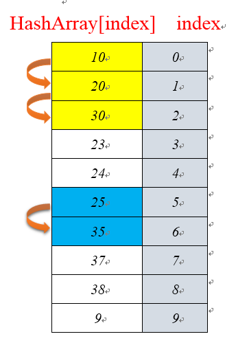
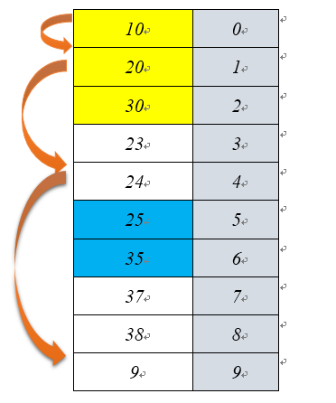

# Hash表
## Hash表简介

hash表作为一种常见数据结构可以提供快速的插入和查找操作，不管哈希表中有多少个数据，插入和删除数据只需要接近O(1)的时间。
这是具有非常大的优势。通常使用hash表速度会比树快，因为树需要O（N）时间级。
不过hash表是基于数组的，创建后比较难扩展，使用不灵活。这样就注定需要面对动态内存问题，通常的思路是对数组进行扩展，
将之前的数据复制到新的数组中并释放原来的内存。

hash表就是key—value键值对模型。将关键字映射为相应号码。依然是以关键字作为索引，例如字典，hash表就是非常适合这种数据的存储。
从a到z的单词都写入内存，实现快速读写。

`哈希函数`

哈希函数是实现将一个大范围内的数字转化为一个小范围的数字。这个小范围的数字对应数组的下标。
使用哈希函数向数组中插入数据后，这个数组就称为哈希表。通常%（取余）是办法中的一种。

`哈希过程中的冲突`

将大范围的数字转化为小范围的数字会出现冲突。因为是采用数组进行存储，可能会出现将几个不同的数据哈希化到同一个数组单元。
这就形成了冲突。这时候需要解决这种冲突。方法之一就是在新开辟的数组中依次有序寻找空位进行存储。这就是地址开放法的由来。

`开放地址法`

根据以上hash函数计算数组下标时，当遇到数据存放的冲突时就需要重新找到数组的其他位置。
关于开放地址法通常需要有三种方法：线性探测、二次探测、再哈希法。

`线性探测`

线性探测方法就是线性探测空白单元。当数据通过哈希函数计算应该放在700这个位置，
但是700这个位置已经有数据了，那么接下来就应该查看701位置是否空闲，再查看702位置，依次类推。
需要注意的是：当哈希表中接近被填满时，向表中插入数据就会效率很低，当hash表真的被填满了，
这时候算法应该停止，在这之前应该对数组进行扩展，对hash表中的数据进行转移。

`聚集`

当哈希表越来越满时聚集越来越严重，这导致产生非常长的探测长度，后续的数据插入将会非常费时。
通常数据超过三分之二满时性能下降严重，因此设计哈希表关键确保不会超过这个数据容量的一半，最多不超过三分之二。

`线性探测的操作流程`

线性探测就是使用算术取余的方法计算余数，当产生冲突时就通过线性递增的方法进行探测，一直到数组的位置为空，插入数据项即可。

以上是通过一个长度是10的数组进行hash存储。对数据10 20 30 23 24 25 35 37 38 9进行储存，数组长度为10；
那么当第一个10%10=0，即把10放入HashArray[0]位置上，当对下一个数字20进行存储时，
计算20%10=0,此时HashArray[0]已经有数据了，其实通过线性探测对HashArray[1]进行探测。
此时HashArray[1]null,将数据20插入该位置，其他数据插入同理

`扩展数组`
      
当hash表变得很满时，必要的选择就是对数组进行扩展。由于数组具有固定大小，不能随意变化。
常用的就是新建数组复制数据，一般可以选择将新建的数组扩展为原来的两倍，
更好的选择是将数组长度设置为一个质数。计算新数组的容量是重新hash计算的一部分。
java中vector类就是采用扩展数组的方式。

`如何解决线性探测过程产生的聚集问题`

在线性探测过程中会产生数据聚集问题，当数据聚集越来越大时，数据经哈希化后就需要插在聚集的后端。
这样会使得效率变得很低。二次探测是防止聚集产生的一种尝试，相隔比较远的单元进行探测，而不是线性一个个的探测。

`二次探测`

二次探测是过程是x+1,x+4,x+9,以此类推。二次探测的步数是原始位置相隔的步数的平方。

`关于装填因子`

hash表中的数据项和表长的比例叫做装填因子。当装填因子不太大时，聚集分布就会比较连贯。
此时hash表肯刚是某一个部分产生大量聚集，另外一部分还很稀疏。聚集会降低hash表的性能。

以下步骤可以表示二次平方探测的过程：

`二次探测产生的聚集`

二次探测可以消除在线性探测中产生的聚集问题，但是二次探测还是会产生一种更明确更细的聚集。
二次聚集的产生是在二次探测的基础上产生的现象。例如N个数据经hash函数计算后都映射到到数组下标10，
探测第二个数字需要以一步长，第三个数字需要以4步长为单位，第四个数字则需要以九为步长。
好在二次探测并不常用，解决聚集问题还是有一种更好的办法：再哈希法。

`再哈希法`

再哈希是把关键字用不同的哈希函数再做一遍哈希化，用这个结果作为步长，对指定的关键字，
探测的步长是不变的，可以说不同的关键字可以使用不同的步长，并且步长可以控制。

`hash表的容量通常设置成一个质数`

通常hash表数组长度是一个质数，这是因为假设hash表的长度不是一个质数为15，
那么对于那些映射在数组单元0的数字步长为5，就会探索在0->5->10->0->5->10->0一直循环下去，
算法只能尝试着三个位置，这是达不到要求。如果数组容量是11（是一个质数），这样就可以探测所有单元，
0->5->10->4->9->3->8->2->7->1->6->0。采用质数作为数组容量会保证探测到每一个单元。

以上是使用地址开放的策略以及关于地址开放的三种探测方法，探测序列通常使用再哈希法生成。
