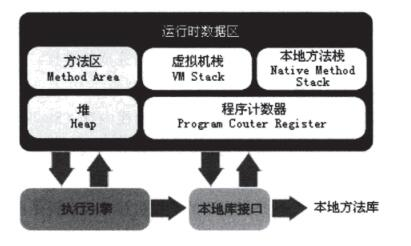
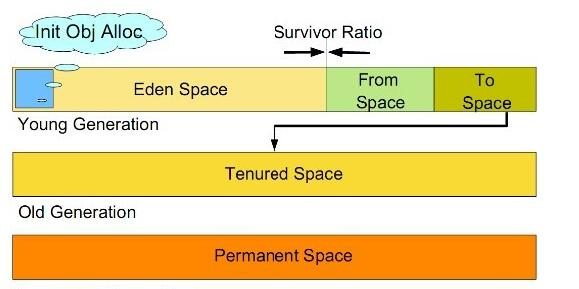

## 内存
**运行时数据区**

- 方法区：   
- 虚拟机栈：     
  线程私有，可以动态扩展大小；超过栈深度会抛出StackOverflowError异常
- 本地方法栈：        
  Native方法调用
- 堆：        
  线程共享，物理地址不一定连续
- 程序计数器：        
  线程私有的一块小内存，可以说是存有代码行号的指示器... 
- 常量池：      
静态值，常量之类存放的地方
- 直接内存：        
  Native方法会用到，一般java比较少用
  
## GC回收     
**算法**
- 引用计算算法：  
- 根搜索算法：        
  引用GC ROOT，只要引用数为零的时候回收
- java 四大引用 -> 强、弱、虚、软：

**垃圾收集算法**      
- 标记-清除算法：      
  先标记，后清除；效率比较低，内存碎片化，找不到足够大的内存会触发GC
- 复制算法：     
  需要额外的空间
- 标记-整理算法：
- 分代收集算法：       
  分成几块，比如新生代和老年代
  
**垃圾回收器**
- 串行收集器：        
  单线程，收集是会 stop the world
- ParNew收集器：        
  串行收集器的多线程版
- 并行收集器：
- CMS集器：
- G1收集器：        
  回收优先
  
**内存分配和回收策略**    

*内存分配*     

- 新生代垃圾回收：     
  a) 所有新生成的对象首先都是放在年轻代的。
  年轻代的目标就是尽可能快速的收集掉那些生命周期短的对象。      
  b)
  新生代内存按照8:1:1的比例分为一个eden区和两个survivor(survivor0,survivor1)区。
  一个Eden区，两个 Survivor区(一般而言)。大部分对象在Eden区中生成。
  回收时先将eden区存活对象复制到一个survivor0区，然后清空eden区，
  当这个survivor0区也存放满了时，则将eden区和survivor0区存活对象复制到另一个survivor1区，
  然后清空eden和这个survivor0区，此时survivor0区是空的，
  然后将survivor0区和survivor1区交换，即保持survivor1区为空， 如此往复。       
  c) 当survivor1区不足以存放 eden和survivor0的存活对象时，
  就将存活对象直接存放到老年代。若是老年代也满了就会触发一次Full GC，
  也就是新生代、老年代都进行回收。        
  d) 新生代发生的GC也叫做Minor
  GC，MinorGC发生频率比较高(不一定等Eden区满了才触发)。        
  e) 一般使用复制收集算法。
- 老年代垃圾回收：      
  a) 在年轻代中经历了N次垃圾回收后仍然存活的对象，就会被放到年老代中。
  因此，可以认为年老代中存放的都是一些生命周期较长的对象。        
  b) 内存比新生代也大很多(大概比例是1:2)，当老年代内存满时触发Major
  GC即Full GC， Full
  GC发生频率比较低，老年代对象存活时间比较长，存活率标记高。     
  c）一般使用标志-整理算法。
  
## 虚拟机参数配置
**常见配置汇总**      
- java -Xmx3550m -Xms3550m -Xss128k -XX:NewRatio=4 -XX:SurvivorRatio=4 
-XX:MaxPermSize=16m -XX:MaxTenuringThreshold=0       
-Xmx3550m ：设置JVM最大可用内存为3550M。       
-Xms3550m ：设置JVM促使内存为3550m。此值可以设置与-Xmx相同，以避免每次垃圾回收完成后JVM重新分配内存。     
-Xmn2g ：设置年轻代大小为2G。整个堆大小=年轻代大小 + 年老代大小 + 持久代大小 。
持久代一般固定大小为64m，所以增大年轻代后，将会减小年老代大小。
此值对系统性能影响较大，Sun官方推荐配置为整个堆的3/8。      
-Xss128k ： 设置每个线程的堆栈大小。JDK5.0以后每个线程堆栈大小为1M，以前每个线程堆栈大小为256K。
更具应用的线程所需内存大小进行调整。在相同物理内 存下，减小这个值能生成更多的线程。
但是操作系统对一个进程内的线程数还是有限制的，不能无限生成，经验值在3000~5000左右。      
-XX:NewRatio=4 :设置年轻代（包括Eden和两个Survivor区）与年老代的比值（除去持久代）。        
设置为4，则年轻代与年老代所占比值为1：4，年轻代占整个堆栈的1/5      
-XX:SurvivorRatio=4 ：设置年轻代中Eden区与Survivor区的大小比值。设置为4，
则两个Survivor区与一个Eden区的比值为2:4，一个Survivor区占整个年轻代的1/6       
-XX:MaxPermSize=16m :设置持久代大小为16m。       
-XX:MaxTenuringThreshold=0 ：设置垃圾最大年龄。如果设置为0的话，则年轻代对象不经过Survivor区，
直接进入年老代 。对于年老代比较多的应用，可以提高效率。如果将此值设置为一个较大值，
则年轻代对象会在Survivor区进行多次复制，这样可以增加对象再年轻代的存活时间 ，增加在年轻代即被回收的概论。
- 堆设置
-Xms :初始堆大小     
-Xmx :最大堆大小     
-XX:NewSize=n :设置年轻代大小      
-XX:NewRatio=n: 设置年轻代和年老代的比值。如:为3，表示年轻代与年老代比值为1：3，
年轻代占整个年轻代年老代和的1/4     
-XX:SurvivorRatio=n :年轻代中Eden区与两个Survivor区的比值。
注意Survivor区有两个。如：3，表示Eden：Survivor=3：2，一个Survivor区占整个年轻代的1/5        
-XX:MaxPermSize=n :设置持久代大小
- 收集器设置     
-XX:+UseSerialGC :设置串行收集器       
-XX:+UseParallelGC :设置并行收集器     
-XX:+UseParalledlOldGC :设置并行年老代收集器      
-XX:+UseConcMarkSweepGC :设置并发收集器        
- 垃圾回收统计信息
-XX:+PrintGC        
-XX:+PrintGCDetails     
-XX:+PrintGCTimeStamps      
-Xloggc:filename        
- 并行收集器设置       
-XX:ParallelGCThreads=n :设置并行收集器收集时使用的CPU数。并行收集线程数。     
-XX:MaxGCPauseMillis=n :设置并行收集最大暂停时间        
-XX:GCTimeRatio=n :设置垃圾回收时间占程序运行时间的百分比。公式为1/(1+n)       
- 并发收集器设置       
-XX:+CMSIncrementalMode :设置为增量模式。适用于单CPU情况。     
-XX:ParallelGCThreads=n :设置并发收集器年轻代收集方式为并行收集时，使用的CPU数。并行收集线程数。    

### 工具使用
*在java sdk 安装目录下，有一些cmd命令可以帮助分析jvm运行时：*
- jstat：
- jinfo：
- jconsole：         
  图像界面，可以看到很多有用的参数      
  
**同目录下还有其他不少有用的工具**

  
  
    
   
