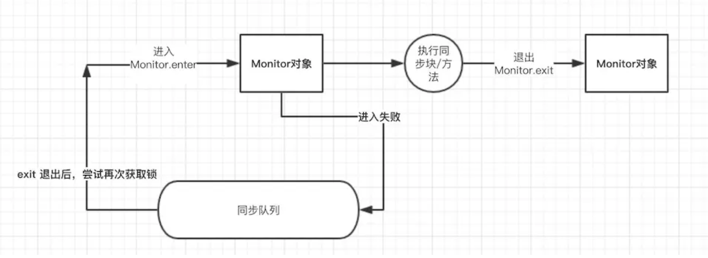

`目录：`
  - [锁
](#048a7dc16267202534eb99158191e6cf)
    - [synchronized原理
](#c389fe8b2b230ad19e9e97ee186420ae)
      - [`锁优化` 
](#254937b7ccd2da7d694337fbd7cd8f10)
      - [`轻量锁`
](#6dfc7d00a5c10f6729c34f8527c39f1f)
      - [`解锁 `
](#48b76aee1c6f11a4b140d253c0ef5cc8)
      - [`偏向锁` 
](#dac4489cc88ca3b1b8456c89e2af0b62)
      - [`释放锁`
](#fef7d448ca90ac64618258ea6c9d535d)
      - [`其他优化`
](#4717c4b7581329f6dfdb021a7ae47046)
    - [synchronized和lock
](#2ea0f7b3f03a3a8ce6d7946a7c07b148)
      - [`一、synchronized和lock的用法区别`
](#4bed392ad516e8e6e40055d460a4e7c9)
      - [`二、synchronized和lock性能区别`
](#d4ebbe3962223d18c5dd935e2541b75a)
      - [`三、synchronized和lock用途区别`
](#ae47e1ac06dd2a6ba935ea05ffb51cab)
    - [volatile
](#3a5667c2b61e050d052101491b3d523a)

---
## 锁

### synchronized原理

众所周知 Synchronize 关键字是解决并发问题常用解决方案，有以下三种使用方式:

同步普通方法，锁的是当前对象。
同步静态方法，锁的是当前 Class 对象。
同步块，锁的是 {} 中的对象。

实现原理：
JVM 是通过进入、退出对象监视器( Monitor )来实现对方法、同步块的同步的。
具体实现是在编译之后在同步方法调用前加入一个 monitor.enter 指令，在退出方法和异常处插入 monitor.exit 的指令。
其本质就是对一个对象监视器( Monitor )进行获取，而这个获取过程具有排他性从而达到了同一时刻只能一个线程访问的目的。
而对于没有获取到锁的线程将会阻塞到方法入口处，直到获取锁的线程 monitor.exit 之后才能尝试继续获取锁。

#### `锁优化` 

synchronize 很多都称之为重量锁，JDK1.6 中对 synchronize
进行了各种优化，为了能减少获取和释放锁带来的消耗引入了偏向锁和轻量锁。
 
#### `轻量锁`

当代码进入同步块时，如果同步对象为无锁状态时，当前线程会在栈帧中创建一个锁记录(Lock
Record)区域，同时将锁对象的对象头中 Mark Word 拷贝到锁记录中，再尝试使用 CAS 将
Mark Word 更新为指向锁记录的指针。 如果更新成功，当前线程就获得了锁。 如果更新失败
JVM 会先检查锁对象的 Mark Word 是否指向当前线程的锁记录。
如果是则说明当前线程拥有锁对象的锁，可以直接进入同步块。
不是则说明有其他线程抢占了锁，如果存在多个线程同时竞争一把锁，轻量锁就会膨胀为重量锁。

#### `解锁 `

轻量锁的解锁过程也是利用 CAS 来实现的，会尝试锁记录替换回锁对象的 Mark Word
。如果替换成功则说明整个同步操作完成，失败则说明有其他线程尝试获取锁，这时就会唤醒被挂起的线程(此时已经膨胀为重量锁)

轻量锁能提升性能的原因是：认为大多数锁在整个同步周期都不存在竞争，所以使用 CAS
比使用互斥开销更少。但如果锁竞争激烈，轻量锁就不但有互斥的开销，还有 CAS
的开销，甚至比重量锁更慢。 

#### `偏向锁` 

为了进一步的降低获取锁的代价，JDK1.6
之后还引入了偏向锁。

`偏向锁的特征是:`锁不存在多线程竞争，并且应由一个线程多次获得锁。
当线程访问同步块时，会使用 CAS 将线程 ID 更新到锁对象的 Mark Word
中，如果更新成功则获得偏向锁，并且之后每次进入这个对象锁相关的同步块时都不需要再次获取锁了。

#### `释放锁`

当有另外一个线程获取这个锁时，持有偏向锁的线程就会释放锁，释放时会等待全局安全点(这一时刻没有字节码运行)，接着会暂停拥有偏向锁的线程，根据锁对象目前是否被锁来判定将对象头中的
Mark Word 设置为无锁或者是轻量锁状态。

轻量锁可以提高带有同步却没有竞争的程序性能，但如果程序中大多数锁都存在竞争时，那偏向锁就起不到太大作用。可以使用
-XX:-userBiasedLocking=false 来关闭偏向锁，并默认进入轻量锁。
 
#### `其他优化`

适应性自旋 在使用 CAS 时，如果操作失败，CAS 会自旋再次尝试。由于自旋是需要消耗
CPU 资源的，所以如果长期自旋就白白浪费了 CPU。JDK1.6加入了适应性自旋。

### synchronized和lock

#### `一、synchronized和lock的用法区别`

 
synchronized：在需要同步的对象中加入此控制，synchronized可以加在方法上，也可以加在特定代码块中，括号中表示需要锁的对象。
 
lock：需要显示指定起始位置和终止位置。一般使用ReentrantLock类做为锁，多个线程中必须要使用一个ReentrantLock类做为对象才能保证锁的生效。
且在加锁和解锁处需要通过lock()和unlock()显示指出。所以一般会在finally块中写unlock()以防死锁。
 
#### `二、synchronized和lock性能区别`

 
synchronized是托管给JVM执行的，而lock是java写的控制锁的代码。在Java1.5中，synchronize是性能低效的。
因为这是一个重量级操作，需要调用操作接口，导致有可能加锁消耗的系统时间比加锁以外的操作还多。相比之下使用Java提供的Lock对象，性能更高一些。
但是到了Java1.6，发生了变化。synchronize在语义上很清晰，可以进行很多优化，有适应自旋，锁消除，锁粗化，轻量级锁，偏向锁等等。
导致在Java1.6上synchronize的性能并不比Lock差。官方也表示，他们也更支持synchronize，在未来的版本中还有优化余地。
 
说到这里，还是想提一下这2中机制的具体区别。synchronized原始采用的是CPU悲观锁机制，即线程获得的是独占锁。
独占锁意味着其他线程只能依靠阻塞来等待线程释放锁。而在CPU转换线程阻塞时会引起线程上下文切换，当有很多线程竞争锁的时候，会引起CPU频繁的上下文切换导致效率很低。
 
而Lock用的是乐观锁方式。所谓乐观锁就是，每次不加锁而是假设没有冲突而去完成某项操作，如果因为冲突失败就重试，直到成功为止。
乐观锁实现的机制就是CAS操作（Compare and Swap）。我们可以进一步研究ReentrantLock的源代码，会发现其中比较重要的获得锁的一个方法是compareAndSetState。
这里其实就是调用的CPU提供的特殊指令。
 
现代的CPU提供了指令，可以自动更新共享数据，而且能够检测到其他线程的干扰，而 compareAndSet() 就用这些代替了锁定。
这个算法称作非阻塞算法，意思是一个线程的失败或者挂起不应该影响其他线程的失败或挂起的算法。
 
我也只是了解到这一步，具体到CPU的算法如果感兴趣的读者还可以在查阅下，如果有更好的解释也可以给我留言，我也学习下。
 
#### `三、synchronized和lock用途区别`

 
synchronized原语和ReentrantLock在一般情况下没有什么区别，但是在非常复杂的同步应用中，请考虑使用ReentrantLock，特别是遇到下面2种需求的时候。

Lock的锁定是通过代码实现的，而 synchronized 是在 JVM 层面上实现的；
synchronized在锁定时如果方法块抛出异常，JVM
会自动将锁释放掉，不会因为出了异常没有释放锁造成线程死锁。 但是 Lock
的话就享受不到 JVM 带来自动的功能，出现异常时必须在 finally
将锁释放掉，否则将会引起死锁。

### volatile

Volatile关键字就是确保了可视性，当声明一个变量为volatile的，一个线程修改了该变量的值，其他线程也可以看到该修改。
添加了volatile关键字的属性，会立刻被写入到主存中，这样就避免了不同步的问题。

synchronized和volatile有什么区别呢。
- (1)volatile是一种比synchronized更加轻量级的同步机制。volatile不会执行加锁操作，也不会阻塞线程。
- (2)如果代码当中过度依赖volatile，那么将会使代码更脆弱，也更难以理解。
- (3)加锁机制既可以保证可见性又可以保证原子性。而volatile只确保可见性。